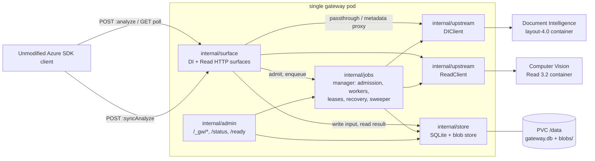
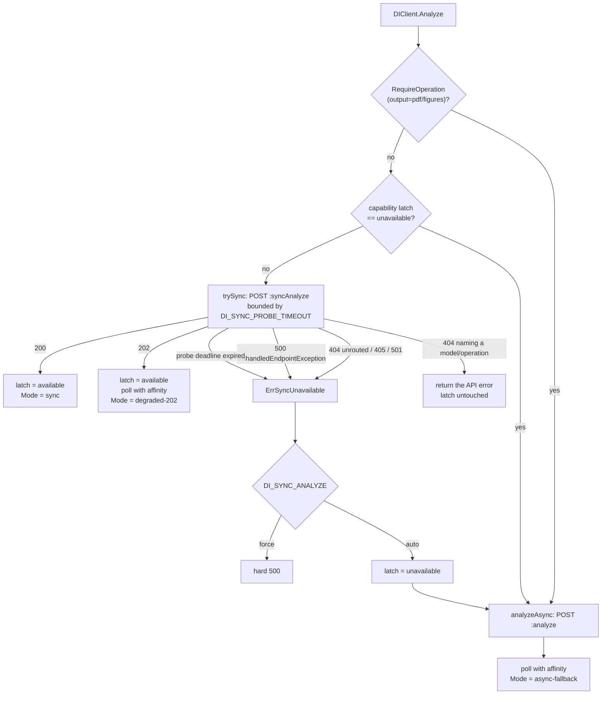
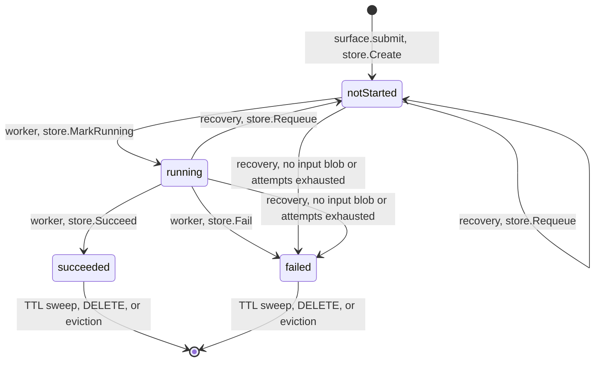

# Gateway architecture

This document explains how `azure-gateway-api` works on the inside, for an engineer who is about
to change it. It covers why the gateway exists, what each package owns, the exact order of
operations on every request path, the upstream decision tree, the storage and concurrency models,
and a list of invariants a change must not break. Everything here is stated against the code in
this repository; where a fact could not be verified in the source it is marked as such. For the
client-facing contract itself see [`docs/api-surface.md`](api-surface.md); for the approved design
and the review record see
[the design spec](superpowers/specs/2026-09-08-azure-gateway-api-design.md); for operator-facing
configuration see [`README.md`](../README.md).

---

## 1. Why a gateway exists at all

The gateway fronts two on-prem Azure AI containers: Document Intelligence `prebuilt-layout`
(`api-version=2024-11-30`) and Computer Vision Read v3.2 (`model-version=2022-04-30`). Their
*synchronous* behaviour is fine. Their *asynchronous* behaviour is not, and the reason is a
configuration default rather than a bug. In the shipped default configuration the async result
store is container-local: Read v3.x writes results to the container's own `/share` directory and
uses an **in-memory** queue that Microsoft's own documentation labels "Development and testing";
the DI layout container writes to its ephemeral layer unless `SharedRootFolder`/`Mounts:Shared`
are set, with the same in-memory queue. All of this is set out in
[`docs/api-surface.md` §8](api-surface.md#8-multi-replica-failure-mode), which is the reference
for every claim in this section.

Three consequences follow, and they compound. A `resultId` minted by replica A is meaningless to
replica B, so a poll that a load balancer routes elsewhere either 404s or reports `running`
forever — §8.3 records that nobody has pinned down which and lays out both plausible modes, and
§11's open-questions table (row Q-X1) calls the exact status and body of a cross-pod poll
"the single most important unknown in this document". A restart destroys in-flight
work with **no failure signal** and invalidates every operation id already handed to a client. And
`HealthCheck:MemoryUpperboundInMB` defaults to the container's recommended memory, so under memory
pressure the container self-reports unhealthy, the kubelet restarts the pod mid-analysis, and
every stored-but-unretrieved result on that pod is destroyed. §8.4 then explains why a lost poll
is worse than it sounds: a 404 on an in-flight poll raises `HttpResponseError` in Python, marks
the operation **terminally failed** in .NET and JS, and in Java — whose poller never checks the
HTTP status at all — surfaces as an opaque `NullPointerException`.

Microsoft's only supported fix is a shared backing store: `Storage:ObjectStore:AzureBlob:
ConnectionString` plus `Queue:Azure:ConnectionString`, with the flat constraint *"Currently only
Azure Storage and Azure Queue are supported"*. Redis and RabbitMQ were removed in v3.x, so the
install doc's own advice to configure an external cache is stale — setting `Cache:Redis` on a 3.2
container silently does nothing. There is no S3 option and no MinIO option. Outside Azure that fix
simply does not exist, which is exactly the situation §8.2 item 7 describes: *"Air-gapped customers
have no supported shared backend at all."* So the gateway takes ownership of the asynchronous
lifecycle itself. Clients keep the `202 + Operation-Location + poll` contract every Azure SDK is
generated against; the gateway serves those polls from its own durable store on a PVC, and the
call it makes to the container underneath is synchronous wherever the container allows it.

---

## 2. The shape of the system

One pod, one process, one PVC. Operation ids are pod-local by construction, which is precisely why
a PVC is the right store and a second gateway replica is wrong (`README.md`, "Running it": one
replica, `strategy: Recreate`).



### Packages

`cmd/gateway` sits on top and wires everything; every other row depends only on rows listed *above*
it, with one exception — `httpx` also depends on `ids`, which the table lists later. `config`,
`logging`, `azerr`, `ids`, `jsonx`, `store` and `mockazure` have no gateway-internal dependencies at
all.

| Package | Owns | Depends on (internal) |
|---|---|---|
| `cmd/gateway` | wiring, the `serve` / `probe` / `version` subcommands, the two-context lifecycle and the shutdown sequence | everything below |
| `internal/config` | env-driven configuration, fail-fast validation, `Warnings()`, `Redacted()` | — |
| `internal/logging` | `log/slog` JSON or text handler, request-scoped logger in the context | — |
| `internal/httpx` | middleware (`RequestID`, `AccessLog`, `Recover`, `NoCache`), `WriteJSON`, `SetRetryAfter`, `BaseURLResolver` | `ids`, `logging` |
| `internal/azerr` | both error shapes, the DI/Read code catalogues, `ParseUpstream`, the `observed`/`documented` compat switch | — |
| `internal/ids` | canonical 36-char lowercase v4 GUIDs; `Valid` / `Normalize` | — |
| `internal/jsonx` | byte-range location of a member inside a large JSON document, without materialising it | — |
| `internal/store` | the SQLite job store (`db.go`), the atomic blob store (`blob.go`), disk usage and network-FS detection (`fs_*.go`) | — |
| `internal/upstream` | one blocking `Analyze` per surface, the DI sync-route decision tree, affinity polling, passthrough and metadata proxying | `azerr`, `config`, `jsonx`, `store` |
| `internal/jobs` | admission and upstream semaphores, the worker pool, leases and heartbeats, the claim set, crash recovery, the TTL/eviction/orphan sweeper, artifact capture | `azerr`, `config`, `jsonx`, `store`, `upstream` |
| `internal/surface` | the client-facing handlers; `di.go` and `read.go` sit over a shared submit/poll/passthrough core in `surface.go` | `azerr`, `config`, `httpx`, `ids`, `jobs`, `logging`, `store`, `upstream` |
| `internal/admin` | `/_gw/{live,ready,health,version,config,jobs,metrics}` plus container-shaped `/status` and `/ready` | `config`, `httpx`, `jobs`, `store`, `upstream` |
| `internal/app` | assembles the served handler: both surfaces, admin, the catch-all and the middleware chain. Exists so `cmd/gateway` and `test/conformance` cannot build different gateways — they did, and the suite could not see the difference | `admin`, `azerr`, `config`, `httpx`, `jobs`, `store`, `surface`, `upstream` |
| `internal/probe` | the live-container capability probe behind `gateway probe` | `config` |
| `internal/mockazure` | in-process fakes of both containers **including their failure modes** | — |

`internal/surface` is deliberately one package rather than two. The two surfaces differ only in
URL shape and error vocabulary; splitting them would have duplicated the whole lifecycle to
separate about forty lines (design spec, "Implementation notes").

### Route ownership

| Prefix | Registered in | Notes |
|---|---|---|
| `/documentintelligence/**` | `internal/surface/di.go` `registerDI` | `POST .../documentModels/{action}` captures `prebuilt-layout:analyze` whole and splits the verb off in `diAction` |
| `/formrecognizer/**` | same handlers, same file | served because a probe found the containers declaring that family; the prefix the caller arrived on is echoed in `Operation-Location`. All nine routes are registered on both families, metadata included — a legacy SDK pinned to `/formrecognizer` calls `GetResourceDetails` and `GetDocumentModel` on its own prefix, and serving those under `/documentintelligence` alone answered it the catch-all's bodyless 404 |
| `/vision/v3.2/read/**` | `internal/surface/read.go` `registerRead` | `POST analyze`, `POST syncAnalyze`, `GET`/`HEAD analyzeResults/{operationId}` only — **no DELETE**, because the Read contract does not define one |
| `/_gw/**`, `/status`, `/ready` | `internal/admin/admin.go` `Register` | `/_gw` can never collide with an Azure route; both containers claim `/status` and `/ready` at their root, so the gateway serves its own rather than picking a winner |
| a routed path, wrong verb | `internal/app` `unrouted` | `405` with an `Allow` header, matching the containers |
| everything else | `internal/app` `unrouted` | bodyless 404, matching both containers' answer to an unrouted path (`azerr.Unrouted`) |

---

## 3. Request lifecycles

### 3.1 Async submit — the durability contract

`internal/surface/surface.go` `submit` is shared by both surfaces. The order below is the contract,
not an implementation detail.

```mermaid
sequenceDiagram
    participant C as Client SDK
    participant S as surface.submit
    participant J as jobs.Manager
    participant B as store.BlobStore
    participant D as store (SQLite)

    C->>S: POST :analyze (body streaming)
    S->>S: BaseURL.Resolve(r); empty means 500
    S->>J: DiskPressure? then 503 plus Retry-After
    S->>J: Admit(surface); ErrBusy means 429 plus Retry-After
    S->>S: ids.New(), SetReadDeadline(UPLOAD_TIMEOUT)
    S->>B: WriteFrom(id, KindInput, r.Body, MAX_REQUEST_BYTES)
    B-->>S: temp, fsync, rename, fsync dir
    S->>D: Create(job) with status notStarted (synchronous=FULL)
    D-->>S: COMMIT
    S->>J: Enqueue(surface, id); claim plus queue
    S-->>C: 202, Operation-Location, Retry-After, Content-Length: 0
```

Why that order and not another: the 202 *is* the durability promise. The moment a client holds an
operation id, that id has to resolve for its whole TTL across any crash short of losing the
volume. If the 202 were written before the `INSERT` committed, a crash in that window would leave
the client polling an id that never existed — and per §8.4 a 404 on what the client believes is a
live operation is a hard failure in every SDK family, including an opaque `NullPointerException`
in Java. If the row were committed before the input blob was fsynced, recovery would find a job it
cannot re-run. The blob store's write protocol (`store/blob.go` `Writer.Commit`) is
temp file → `Sync` → `Rename` → `syncDir`, so a reader never observes a partial file, and
`syncDir` deliberately propagates every fsync error except the handful filesystems legitimately
reject (`EINVAL`, `ENOTSUP`, `EBADF`, `EISDIR`) — reporting a rename as durable when it might not
survive power loss would undermine the 202 that rests on it.

Two failure branches inside `submit` are worth knowing. `store.ErrLimitExceeded` from the blob
write becomes `azerr.ContentTooLarge`, which is a **400**, not a 413: 413 is unmodelled on both
surfaces and an nginx sidecar produces HTML for it. And if `Enqueue` fails after the row is
committed, the client gets a 429 rather than a lie — the row is valid and the recovery pass will
pick it up.

The response headers are as load-bearing as the body. Exactly `202`; an absolute
`Operation-Location` in this surface's shape; an integer-seconds `Retry-After`; `Content-Length: 0`;
and no `Location` header, because Python and JS would issue an extra final GET to it and parse
*that* as the analyze result.

### 3.2 Poll — four states

`internal/surface/surface.go` `poll`. `ids.Normalize` runs first, so a malformed id never reaches
the store; the job's `surface` column is checked so a DI id cannot be polled on the Read path.

| State | Condition | Response |
|---|---|---|
| unknown / expired | `ids.Normalize` fails, `store.Get` errors, surface mismatch, or `now > expires_at` | `404` from `azerr.NotFound(surface)`. DI: flat `{"code":"NotFound","message":"Analyze result does not exist."}`. Read: **wrapped** `{"error":{"code":"BadArgument","message":"Operation ID is invalid, expired or the results matching this operationId have been deleted."}}` — only the DI case sets `flat`, so in the default `ERROR_COMPAT=observed` every other error keeps its wrapper; the Read body goes flat only under `documented` |
| `notStarted` / `running` | default branch | `200` + `Retry-After: POLL_RETRY_AFTER` + `{"status":…,"createdDateTime":…,"lastUpdatedDateTime":…}`. No `analyzeResult` member at all — a null one makes .NET's `AnalyzeResult.FromLroResponse` throw |
| `succeeded` | `streamResult` | `200`, `application/json; charset=utf-8`, exact `Content-Length`, the stored envelope copied byte for byte. If the result blob is missing, this degrades to a `200` `failed` envelope rather than a 500 |
| `failed` | `store.StatusFailed` | `200` with `{"status":"failed",…}` and the stored Azure-shaped `error` object when `error_json` parses. **No `Retry-After`** |

A failed analysis being HTTP 200 is not a stylistic choice: it is how both containers behave and it
is the dominant failure mode on both surfaces. Note also what is absent — the succeeded and failed
branches never set `Retry-After`, because the header is a pacing hint for a poll that will be
repeated. `api-surface.md` §10 item 6 puts it on the 202 and on every non-terminal 200 poll, and
nowhere else; a terminal poll is answered once and has nothing to pace.

### 3.3 Synchronous passthrough, and the degraded-202 resolution

`internal/surface/di.go` `passthrough` handles both surfaces' `:syncAnalyze`. Nothing is persisted:
the client holds the connection and will have the whole result when it returns, so there is no
operation id to keep alive.

```mermaid
sequenceDiagram
    participant C as Client
    participant P as surface.passthrough
    participant U as upstream.base.syncAnalyze
    participant K as Container

    C->>P: POST :syncAnalyze
    P->>P: Admit and AdmitUpstream (429 if either is full)
    P->>U: SyncAnalyze(req, contentType, MaxBytesReader(body))
    U->>K: POST syncAnalyze (per-call affinity client)
    alt not 202
        K-->>U: 2xx or error
        U-->>P: SyncOutcome with Live set
        P->>C: relaySync; 2xx streamed through, errors normalised
    else 202 Accepted
        K-->>U: 202 plus Operation-Location
        U->>U: operationIDFrom(header), discard the rest
        U->>K: pollUntilTerminal on the same conn and cookie jar
        K-->>U: 200 succeeded
        U-->>P: SyncOutcome with Resolved set
        P->>C: writeResolvedSync; 200 succeeded envelope
    end
```

The 202 branch in `internal/upstream/sync.go` is the interesting one. The naive implementation
relays the container's 202 to the caller, and that strands them: the container's own
`Operation-Location` names an address inside the cluster and on the Read container is corrupted
outright when the request authority contains the substring `vision`, so it cannot be handed on;
dropping it leaves a bodyless 202 with no way to reach a result the container has already been
paid to produce. Instead `syncAnalyze` extracts just the id, rebuilds the poll URL against the
*configured* upstream base, and polls it out on the same per-job connection and cookie jar. The
caller then gets a terminal answer at 200, composed by `writeResolvedSync` as
`{"status":"succeeded","createdDateTime":…,"lastUpdatedDateTime":…,"analyzeResult":<streamed>}`
with an exact `Content-Length`. `Result.Mode` is recorded as `degraded-202`.

Error relay is not a relay either. `relaySync` streams any 2xx through with hop-by-hop headers plus
`Operation-Location`, `Location` and `Set-Cookie` dropped (`skipRelayHeader`). A non-2xx body is
read (bounded at 64 KB) and then takes one of three branches, because these routes produce four
different error forms. A body `azerr.ParseUpstream` recognises — including a bare
`{"status":"Failed"}` with no code or message — is re-emitted in this surface's shape at the
container's own status, with the upstream's `Retry-After` explicitly zeroed and re-added only for
statuses where retrying is correct (`retriableStatus`). A body that is non-empty but unparseable —
HTML from an nginx sidecar — becomes `azerr.ForStatus`, which likewise keeps the container's status
instead of synthesising a 500: turning a container's 404 into a server error is both wrong and
actively misleading. And a genuinely empty body is relayed as it arrived — headers through, then
`Content-Length: 0` at the upstream status. That branch exists for the metadata proxy, which shares
`relaySync` through `proxyGET`: a probed build answers `/info` and `/documentModels` with a bodyless
404, and inventing a body there would misrepresent the container.

### 3.4 The worker

`internal/jobs/manager.go` `run`, one per queued job.

```mermaid
sequenceDiagram
    participant Q as runner.queue
    participant W as manager.run
    participant D as store
    participant A as upstream.Analyzer
    participant B as blob store

    Q->>W: job id (already claimed by Enqueue)
    W->>D: Get(id); return if already terminal
    W->>D: MarkRunning(owner, lease now plus 2m, attempts plus 1)
    W->>W: startHeartbeat (Heartbeat every 30s)
    W->>W: AdmitUpstream (busy-wait 100ms until a slot frees)
    W->>A: Analyze(doc from KindInput blob, Request)
    A-->>W: Result with Path, Start, End, Mode, UpstreamOpID
    W->>B: Create(KindResult): prefix, range copy, closing brace
    W->>A: fetchArtifacts (pdf, figures) under ARTIFACT_FETCH_TIMEOUT
    W->>D: Succeed(resultPath, size, mode, ms, hasPdf, figures)
    W->>B: Remove(KindInput)
```

`finish` composes **the exact bytes the gateway will later serve**: the literal prefix
`{"status":"succeeded","createdDateTime":"…","lastUpdatedDateTime":"…","analyzeResult":`, then an
`io.Copy` from an `io.SectionReader` over the `analyzeResult` byte range of the temp file, then
`}`. A later successful poll is therefore a plain file stream — no re-serialisation, no parse cost,
and no need to hold a result Azure permits to reach 500 MB. The store writes run under
`context.WithoutCancel(ctx)`: the analysis is already done, and losing it to a shutdown signal
would mean paying the container to redo it.

Error handling in `run` checks **cancellation first, on the context, not on the error**. During
shutdown the upstream client may already have wrapped the cancellation in a surface-shaped error,
and classifying on the error alone would mark a job terminally failed that recovery could have
resumed — after its 202 was already sent. On genuine failure, `failJob` marshals the error into
`error_json`, and `Succeed`/`Fail` both report `RowsAffected`: if the row went away mid-flight (a
client `DELETE`, or disk-pressure eviction) the just-written artifacts are removed rather than left
on the volume with nothing referencing them.

`fetchArtifacts` runs only for `*upstream.DIClient`, only when `res.UpstreamOpID != ""`, and only
when the submit asked for `output=pdf` or `output=figures`. It is bounded twice over: one aggregate
`ARTIFACT_FETCH_TIMEOUT` budget for the whole phase, and a check between artifacts for worker-context
cancellation, so a shutdown is never held up by work no client is waiting on. A fetched PDF whose
`Content-Type` is not `application/pdf` is discarded — a probed container answered that route `200`
with `application/json`, and storing it would have served clients a file that is not a PDF. Figure
ids are read out of the result by locating the `figures` member's byte range with `jsonx` and
decoding only that (capped at 4 MB).

`DIClient.FetchArtifact` takes the job's own path family as a parameter, and `fetchArtifacts` passes
`job.Prefix`, so the artifact call lands on the same family the analyze and poll calls use
(`prefix(req.Prefix)`). That is not cosmetic: the container scopes an operation id to the family it
was issued under, so fetching from the other one answers 404 — which is how a legacy
`/formrecognizer` job silently lost its searchable PDF and every figure.

---

## 4. The upstream decision tree

`internal/upstream/di.go` `Analyze` is the whole strategy. `internal/upstream/read.go` is the
simple case: Read's synchronous route is documented, so `ReadClient.Analyze` calls it directly and
falls back to `:analyze` only on 404/405.



**Why `:syncAnalyze` at all.** It is undocumented — zero occurrences in `azure-rest-api-specs`, no
SDK method — and was established from the image itself: `"SyncAnalyzePath"` in
`/app/appsettings.api.json`, a compiled route literal in
`Microsoft.CloudAI.Containers.VDI.Endpoint.Analyze.dll`, and the MVC action
`AnalyzeController.SynchronousAnalyze` (`docs/api-surface.md` §7.1). A 200 from it is fully
stateless with respect to the poll, so it load-balances correctly across replicas — that is the
property the whole gateway is trying to buy.

**The 202 degradation.** The route is not contractually synchronous. Under memory pressure the
layout container has been observed answering `202 + Operation-Location`; Microsoft called that
*"not standard or documented behavior"* for this route. The operation then lives only on the
replica that answered, so `trySync` polls it out using the per-job affinity client. Note it polls
under `ctx`, deliberately **not** under `probeCtx`: the probe bound covers deciding whether the
route answers, not how long the analysis it accepted may take.

**Distinguishing "no such route" from "no such model".** A 404 is ambiguous and getting it wrong is
expensive in one direction, because the latch is process-wide and permanent. `resourceScoped404`
therefore only treats a *well-formed* Document Intelligence error naming a resource
(`InnerModelNotFound`, `InnerOperationNotFound`, or a `NotFound` with a message) as a request-scoped
failure; Kestrel's bodyless unrouted 404 falls through to `ErrSyncUnavailable`. Symmetrically,
`looksLikeMissingEndpoint` scans a 500's code and message for `unhandledendpointexception`,
`no candidates found for the request path` and `request did not match any endpoints`, because older
builds answer that instead of a clean 404. This was a real defect: any 404 used to latch the route
off, so one request naming a missing model disabled the fast path for every later job until restart.

**A route that is declared and never answers.** The probed layout-4.0 build listed `:syncAnalyze`
in its own swagger and held the connection open past five minutes on a blank 200×120 PNG. The
attempt previously inherited `DI_UPSTREAM_TIMEOUT` (default `15m`), so in `auto` mode every job
would have paid fifteen minutes before falling back to the route that works. `DI_SYNC_PROBE_TIMEOUT`
(default `60s`, clamped in `NewDI` to at most `up.Timeout`) bounds the attempt alone; when it
expires, `trySync` returns `ErrSyncUnavailable` and the latch turns off for the process.

**The capability latch.** `DIClient.capability` is an `atomic.Int32` holding `syncUnknown`,
`syncAvailable` or `syncUnavailable`. `DI_SYNC_ANALYZE=off` pre-sets it to `unavailable` in `NewDI`;
`force` turns `ErrSyncUnavailable` into a hard 500 instead of latching. The rationale for latching
rather than retrying is stated in the code: the route either exists on an image build or it does
not; it does not appear at runtime. The current value is surfaced as the `syncAnalyze` field on
`/_gw/health` (`unknown` / `available` / `unavailable`).

### The affinity mechanism

Once an operation id exists, only the replica that minted it can resolve it. Two mechanisms in
`internal/upstream/client.go` `newAffinityClient` keep the follow-up polls there, and they are
created **per job**:

- a private `http.Transport` from `newTransport(1)` — `MaxIdleConns` and `MaxIdleConnsPerHost` both
  1, keep-alives explicitly on — so the same TCP connection, and therefore the same HAProxy
  backend, is reused across polls;
- a private `cookiejar`, so the OpenShift router's affinity cookie is replayed.

Redirects are refused (`CheckRedirect` returns `http.ErrUseLastResponse`), and response bodies are
always drained by `drain()` before the connection is released — leaking a body would force a new
TCP connection and with it lose the pinned backend.

Kubernetes `sessionAffinity: ClientIP` cannot substitute for this. Every request originates from
the single gateway pod, so they all share one source IP: the Service would pin *all* traffic to one
backend rather than pinning *each job* to the backend that owns it. That is the opposite of what is
needed, and it also destroys the load spreading the whole deployment depends on.

The poll loop itself is `base.pollUntilTerminal` in `internal/upstream/poll.go`. Backoff doubles
from 500 ms to a 5 s ceiling, and an integer `Retry-After` from the container overrides it (capped
at the same ceiling; HTTP-date values are ignored rather than approximated). Each individual
request carries `context.WithDeadline(ctx, cfg.Deadline)` — without that the job deadline was only a
loop guard and one hung poll could run a full upstream timeout past it while holding an admission
slot. A 404 increments `misses` against the surface's own blind-poll budget — the loop reads
`pollConfig.BlindBudget`, which is `DI_BLIND_POLL_BUDGET` for the DI client and
`READ_BLIND_POLL_BUDGET` for the Read client, both default 60 — and keeps trying, since a later
poll may land on the owning replica; transport errors and 5xx increment a separate `transient`
counter that is **not** capped, only bounded by the job deadline, because capping it at a fixed
count used to abandon a live operation after well under a minute of exactly the container churn
this gateway exists to ride out.

---

## 5. State and storage

### The job state machine



Only four status strings ever exist, and they are exactly the strings both Azure surfaces emit
(`store.StatusNotStarted`, `StatusRunning`, `StatusSucceeded`, `StatusFailed`). `canceled` and
`skipped` are never produced: `cancelled` is terminal in JS only, `skipped` in none. A worker whose
context is cancelled by shutdown makes **no** transition — the job stays `running` and is reclaimed
on the next boot, because its 202 has already been promised.

### Schema

`internal/store/db.go` `schema`. All timestamps are stored as **unix seconds in `INTEGER`
columns** (the design spec's draft used RFC3339 text; the code does not) and converted to UTC on
scan.

```
jobs(id PK, surface, model_id, api_version, status,
     created_at, updated_at, expires_at,            -- INTEGER unix seconds
     request_query, content_type,
     input_path, input_bytes, result_path, result_bytes, error_json,
     attempts, lease_owner, lease_until,
     upstream_mode, upstream_op_url, upstream_status, upstream_ms,
     client_request_id, has_pdf, figures, prefix)

INDEX jobs_status  (status, created_at)
INDEX jobs_expiry  (expires_at)
INDEX jobs_surface (surface, status)
```

`upstream_mode` is one of `sync`, `degraded-202`, `async-fallback` — it is how an operator sees on
`/_gw/jobs` whether `:syncAnalyze` is actually working on their image build.

`upstream_op_url` is **inert**: read back into `store.Job.UpstreamOp`, never written. It was added
so a restart could resume polling a degraded 202 instead of re-submitting, which cannot work here.
A poll only finds an operation because the job's own connection pool and cookie jar pin it to the
replica that minted the id, and neither survives the process — a resumed poll would land on an
arbitrary replica, spend its blind-poll budget on 404s, and fail a job that a re-submit would have
completed. Recovery therefore re-submits from the persisted input. The column is kept rather than
dropped because migrating a live PVC database is the worse trade. `docs/api-surface.md` §9 sketches
the alternative — per-pod addressing behind a headless Service, persisting `upstream_host` next to
the operation id — which is a real design but not this one: the operator's containers are
autoscaled by OpenShift and addressed only through their Service, which is the constraint the
synchronous upstream strategy exists to respect.

### PRAGMAs and the single-writer discipline

`store.Open` builds two DSNs against the same `${DATA_DIR}/gateway.db`:

| PRAGMA | Writer | Reader | Why |
|---|---|---|---|
| `journal_mode` | `WAL` | `WAL` | concurrent readers during a write |
| `synchronous` | **`FULL`** | `NORMAL` | the 202 is a durability promise. Both settings survive an application crash; only `FULL` survives node power loss. SQLite's own documentation says WAL with `NORMAL` "might roll back following a power loss or system crash" — which would hand a client an operation id that no longer exists |
| `busy_timeout` | `10000` | `10000` | ms |
| `foreign_keys` | `ON` | `ON` | — |

The writer pool is `SetMaxOpenConns(1)` / `SetMaxIdleConns(1)` / `SetConnMaxLifetime(0)`. SQLite
permits one writer at a time regardless; serialising in the pool converts lock contention into an
orderly queue and makes `synchronous=FULL`'s cost predictable. The read pool is sized
`DI.MaxInflight + Read.MaxInflight + 8` (`cmd/gateway/main.go`), because polls are the hot path and
are read-only.

`Open` also refuses to start when `DATA_DIR` is on a network filesystem — NFS, SMB, CIFS, CephFS,
FUSE, GFS2, OCFS2 by `Statfs` magic on Linux (`fs_linux.go`); nfs/smbfs/afpfs/webdav by
`Fstypename` on Darwin. WAL depends on shared memory and POSIX advisory locks those do not provide
reliably, and silent corruption is a far worse outcome than a clear startup failure.
`ALLOW_NETWORK_FS=true` overrides it. On any other platform (`fs_other.go`) `diskUsage` returns an
error, so `DiskUsage` reports `ok=false` and eviction is skipped rather than acting on a wrong
number; `networkFS` there reports a plain "not a network filesystem", so the startup check cannot
fire and the store opens normally.

### Blob layout and the atomic write protocol

```
${DATA_DIR}/blobs/{id[0:2]}/{id[2:4]}/{id}.in        -- the uploaded document (KindInput)
                                     /{id}.res       -- the exact envelope served on a poll (KindResult)
                                     /{id}.pdf       -- searchable PDF (KindPDF)
                                     /{id}.fig-<id>  -- one cropped figure (KindFigure)
```

Two-level sharding keeps any one directory small enough that listing stays fast with a day's worth
of results. Every identifier passes through `sanitize()` before it touches a path — gateway ids are
minted GUIDs, but **figure ids come from the upstream response**, so anything outside
`[A-Za-z0-9_-]` becomes `_` and the result is truncated to 128 bytes.

`Writer.Commit` is the protocol: `os.CreateTemp` in the destination directory → `f.Sync()` →
`f.Close()` → `os.Rename` → `syncDir(dir)`. A reader therefore never sees a partial file, and a
crash mid-write leaves at most a `*.tmp-*` file, which `SweepTemp` removes once it is older than an
hour. `Exists()` exists separately from `Open()` because a presence check that used `Open` and
dropped the `*os.File` leaked a descriptor per orphaned job during restart recovery.

### TTL, eviction ordering, and the orphan sweep

`expires_at` is set once at submit to `created_at + RESULT_TTL` (default `24h`, matching the cloud
contract SDK users expect). Enforcement happens in two places: `surface.poll` 404s anything past
`expires_at` immediately, and the sweeper deletes it.

`manager.sweep` runs `sweepOnce` at startup (with `reclaim=false`, because `Recover` covers that
explicitly and doing both would race for the same rows) and then every `GC_INTERVAL` (default `5m`).
One pass does, in order:

1. `store.Expired(now, 512)` → `store.Delete`. The query excludes a `running` job whose lease is
   still live even when expired: deleting it out from under its worker leaves that worker writing a
   result no row references.
2. `Blob.SweepTemp(1h)` — temp files older than an hour cannot belong to a live request.
3. `sweepOrphanBlobs` — walk up to 512 ids in the blob tree, and for any id with no row *and* whose
   blobs are all older than an hour, `RemoveAll`. This is the deliberate counterpart of
   `store.Delete` removing the **row before the blobs**: row-first means the worst case is an
   orphaned blob nobody can observe, whereas blob-first left a row pointing at a result that no
   longer existed, and a poll on that produced the shape that crashes Java clients.
4. `recover(ctx, false)` on the periodic passes only.
5. `evictUnderPressure`.

Eviction only starts above `DISK_HIGH_WATERMARK` (default `0.90`) and stops the moment usage drops
back below it. `EvictionCandidates` orders `ORDER BY (expires_at >= ?) ASC, updated_at ASC` — that
is, **already-expired results first**, then oldest-updated. Only terminal jobs are eligible.
Dropping a result a client could still legitimately fetch is logged individually at warn level with
its `expiresAt`; ordering by `updated_at` alone used to take those while already-expired rows sat
next to them. Separately, `DiskPressure()` — used by `submit` to refuse cleanly with a 503 — trips
only at `watermark + (1-watermark)/2`, i.e. 0.95 by default, so between the two thresholds the
sweeper is expected to make room without the client noticing.

---

## 6. Concurrency

### Four distinct limits

Per surface, in `internal/jobs/manager.go` `newRunner`:

| Gate | Capacity | Acquired | Released | Purpose |
|---|---|---|---|---|
| `admits` | `MAX_INFLIGHT + QUEUE_DEPTH` | at admission (`Admit`), non-blocking | by the worker in `run`'s defer, or by `submit` on any failure before the 202 is written — `committed` is set only once `Enqueue` succeeds, so the deferred release also covers the post-commit `Enqueue` failure, where the row stays valid and recovery picks it up | bounds accepted-but-unfinished work. With the default `QUEUE_DEPTH=0` a submit is refused the moment every worker is busy |
| `upstream` | `MAX_INFLIGHT` | `AdmitUpstream`, by workers **and** by synchronous passthroughs | on completion | bounds concurrent calls into the container. Separate from `admits` because with a queue configured, admission alone would let passthroughs put more work on the container than `MAX_INFLIGHT` allows |
| `metadata` | fixed **4** | `AdmitMetadata` in `proxyGET` | on completion | the read-only proxy lane (`/info`, `/documentModels`). These must not starve analysis nor pile up without bound against a wedged container. Also bounded by `metadataTimeout = 10s`, not the analysis timeout |
| `workers` | `MAX_INFLIGHT` goroutines | — | — | how many jobs actually run at once |

Defaults are `DI_MAX_INFLIGHT=4`, `READ_MAX_INFLIGHT=4`, `QUEUE_DEPTH=0` (`internal/config/config.go`).
`Admit` never blocks; failure is `ErrBusy`, which becomes `azerr.TooBusy` — a 429 that **always**
carries `Retry-After: BUSY_RETRY_AFTER` (default 5), because the JS SDK retries a 429 only when one
of the retry-after headers is present. The upstream containers never emit 429 themselves; they do
not cap TPS.

Inside `run`, a worker that cannot get an upstream slot busy-waits in 100 ms increments rather than
failing the job — it already holds an admission slot, and its 202 has been sent.

### The claim set

`Manager.claims` is a mutex-guarded `map[string]struct{}` of ids this process has queued or
running. `Enqueue` and `recoverOne` both go through `claim(id)`, which returns false on a
duplicate. Two independent paths can reach the same row — a live submit and the boot reclaim, or
the boot reclaim and a periodic one — and each duplicate would be a second billed analysis against
the container for a result only one of them stores. Ordering the callers carefully is not enough;
the claim set makes double-enqueue impossible. `unclaim` runs in `run`'s defer.

### Leases and heartbeats

`MarkRunning` writes `lease_owner` (`"<surface>-<n>"`) and `lease_until = now + 2m`
(`leaseDuration`), and increments `attempts`. `startHeartbeat` refreshes the lease every 30 s
(`heartbeatInterval`) under `context.WithoutCancel`, so a layout analysis that legitimately runs for
many minutes is not reclaimed underneath itself. `Requeue` also takes a lease even though no worker
holds the job yet — that lease is what stops the periodic reclaim pass from picking the same row up
again in the window between requeueing it and a worker marking it running.

Recovery reads the store two different ways, and the difference matters:

- **`store.Abandoned`** (boot, `recover(ctx, true)`) ignores leases entirely. A freshly booted
  process holds no leases, so every unfinished row was abandoned by whatever died. Applying the
  lease filter here was a real defect: a crash leaves `lease_until` minutes in the *future*, so the
  boot pass skipped exactly the jobs it existed to rescue and their clients polled `running`
  forever. It also excludes rows past `expires_at`, so an outage longer than the TTL does not
  resubmit every stored job to produce results whose ids already 404.
- **`store.Orphaned`** (periodic, `recover(ctx, false)`) applies the lease filter *and* only
  considers `notStarted` rows created more than `2 × leaseDuration` (4 minutes) ago, so a row a live
  submit is still handing to a worker is never reclaimed.

A recovered job whose input blob is gone, or whose `attempts >= maxAttempts` (3), is failed with an
Azure-shaped `InternalServerError` rather than retried forever. Otherwise it **waits** for an
admission slot instead of being refused: a 429 is a refusal to make a promise, and these promises
were already made.

### Shutdown

`cmd/gateway/main.go` runs two separate contexts, and this is the single most important detail in
the file:

```go
signalCtx, stopSignals := signal.NotifyContext(context.Background(), syscall.SIGINT, syscall.SIGTERM)
runCtx, stopRun := context.WithCancel(context.Background())
...
srv := &http.Server{
    BaseContext: func(net.Listener) context.Context { return runCtx },
}
```

`signalCtx` only *triggers* the drain. Request contexts derive from `runCtx`, which outlives the
signal. When they were derived from the signal context, `Shutdown` returned in about 1.5 ms because
every in-flight handler had already been cancelled — an in-flight synchronous passthrough that was
seconds from completing died with a 500, and the grace period existed while nothing used it.

The sequence on SIGTERM, in order:

1. `srv.Shutdown(shutdownCtx)` with `shutdownCtx = context.WithTimeout(Background, SHUTDOWN_GRACE)`
   — stop accepting connections, let in-flight handlers finish. Synchronous passthroughs are the
   ones that matter: a client is holding the connection waiting for a result.
2. `manager.Drain(shutdownCtx)` — poll `len(r.admits)` every 100 ms until zero or the grace expires,
   giving background jobs whatever time is left.
3. `manager.Stop()` — cancel the worker context and `wg.Wait()`.
4. `stopRun()`.

Anything still running when the grace expires is logged and left `running` in the store, to be
reclaimed on the next start. `Recover` is called explicitly before the listener opens, never
concurrently with live traffic, because a scan racing live submits could pick up a row that had
just committed but not yet been enqueued and run it twice against the container.

The server also deliberately has **no** `ReadTimeout` and **no** `WriteTimeout`: a client may
legitimately spend minutes streaming a 500 MB document, and a synchronous passthrough holds the
connection for the whole analysis. `ReadHeaderTimeout` (30 s) still bounds a slowloris on the
headers, `IdleTimeout` is 120 s, and per-request upload duration is bounded by `UPLOAD_TIMEOUT`
(default `10m`) applied through `http.NewResponseController().SetReadDeadline` in
`surface.setUploadDeadline` — the admission slot is necessarily taken before the body is read,
because the body has to be written somewhere, so without that deadline a few trickling connections
take a whole surface offline while it looks perfectly healthy.

---

## 7. Memory

`internal/jsonx` exists for one reason: the gateway must extract the `analyzeResult` member from an
upstream response whose size Azure permits to reach 500 MB, and it must do so without holding that
member in memory.

The obvious implementations both fail. Decoding into a `json.RawMessage` buffers the whole member
per in-flight job. Skipping with `encoding/json`'s `Decoder.Token()` looks streaming but is not:
the tokenizer streams the four structural delimiters and **materialises every other token** — it
grows its internal buffer until an entire scalar fits, then allocates the decoded Go string on top.
The largest member of a Document Intelligence `analyzeResult` is `content`, the extracted text of
the whole document as a single JSON string. The tokenizer-based skip was measured at roughly three
times that string's size in heap — **309 MB peak for a 107 MB `content` string** — and four
concurrent workers on large scans were enough to OOM the pod, after which the boot recovery pass
would re-run them and crash-loop it.

So `jsonx` is a byte scanner. `MemberRange` walks the top-level object with a 64 KB `bufio.Reader`,
tracking absolute offsets; `skipValue` walks composites with a depth counter and counts scalars out
to their terminator, retaining nothing. Only member names are ever accumulated, capped at
`maxNameBytes` (4 KB). One subtlety that was a bug: the value's start offset is found by scanning
whitespace after the colon rather than assuming a fixed lookahead — a fixed 64-byte skip produced
an invalid envelope on a pretty-printed response. The regression test
`TestScanDoesNotMaterialiseLargeScalars` asserts that scanning a ~26 MB string allocates less than a
tenth of its size.

The composition path then keeps the result off the heap end to end:

1. `base.downloadBody` streams the upstream response to a temp file inside the blob root, bounded
   by `MAX_RESULT_BYTES` (`io.LimitReader(body, limit+1)`, then reject if `n > limit`), and fsyncs
   it. Nothing is buffered.
2. `inspectOperation` uses `jsonx.ValueRange` to find the byte ranges of `status` and
   `analyzeResult` in that file. Every member read is bounded: `status` at 1 KB (an upstream that
   sent a multi-megabyte status would otherwise be allocated in full), `error` at 64 KB,
   `analyzeResult.errors` at 1 MB, `figures` at 4 MB.
3. `jobs.finish` writes the prefix string, `io.Copy`s an `io.NewSectionReader(src, Start, End-Start)`
   into the blob writer, writes `}`.
4. `surface.streamResult` serves that file with `io.Copy` and an exact `Content-Length`.

`inspectOperation` also handles both shapes the undocumented synchronous routes may return: an
operation envelope with a `status`, or a bare `AnalyzeResult` with neither `status` nor
`analyzeResult`, detected by reading the first 64 bytes and asking `jsonx.IsObject`.

---

## 8. Invariants

These are the properties a future change must not break. Each names the file that enforces it.

1. **The 202 is written only after the input blob is fsynced and the job row is committed.**
   `internal/surface/surface.go` (`submit`), `internal/store/db.go` (`Create`),
   `internal/store/blob.go` (`Writer.Commit`).
2. **The writer connection runs `synchronous=FULL` and `SetMaxOpenConns(1)`.** Anything weaker can
   roll back a committed job on node power loss, which is the one thing the 202 promises will not
   happen. `internal/store/db.go` (`Open`, `dsn`).
3. **Every blob write is temp → fsync → rename → fsync-dir, and `syncDir` propagates real errors.**
   `internal/store/blob.go` (`Writer.Commit`, `syncDir`).
4. **A live operation id is never answered with 404.** Only an unknown, wrong-surface, or
   TTL-expired id gets one. `internal/surface/surface.go` (`poll`), `internal/azerr/azerr.go`
   (`NotFound`).
5. **Every poll response the gateway composes is JSON with a top-level `status`.** A missing
   result blob degrades to a `200` `failed` envelope, never a bare 500. The exception is a panic:
   `internal/app` (`onPanic`) and `internal/httpx` (`Recover`) emit this surface's *error* body,
   which has no `status` member — an SDK poller treats that as a failed request rather than as
   operation state, which is the correct reading of a 500. `internal/surface/surface.go` (`poll`,
   `streamResult`).
6. **The status vocabulary is exactly `notStarted | running | succeeded | failed`.**
   `internal/store/db.go` (`Status` constants).
7. **A submit returns exactly `202`; a poll of a known, unexpired operation on the right surface
   returns exactly `200`** in every state — `notStarted`, `running`, `succeeded`, `failed`. An
   unknown, wrong-surface or TTL-expired id is the one exception, and gets the 404 of invariant 4.
   `internal/surface/surface.go` (`submit`, `poll`).
8. **`Retry-After` is always integer seconds, and is never attached to a non-retriable status.**
   `internal/httpx/httpx.go` (`SetRetryAfter`), `internal/azerr/azerr.go` (`retriable`, `WriteTo`),
   `internal/surface/di.go` (`relaySync` zeroes the upstream value).
9. **No `Location` header on the 202 and no `resourceLocation` in any poll body.**
   `internal/surface/surface.go` (`submit`, `envelope`).
10. **`Operation-Location` is minted by the gateway, never propagated from the container.** The
    upstream header is parsed for its trailing id and otherwise discarded.
    `internal/upstream/poll.go` (`operationIDFrom`), `internal/surface/di.go`
    (`diOperationLocation`, `skipRelayHeader`), `internal/surface/read.go`
    (`readOperationLocation`).
11. **The DI `Operation-Location` keeps its exact shape**: absolute, containing the literal family
    segment, `modelId` four segments from the end and `resultId` two, `?api-version=` present, and
    percent-encoded. `internal/surface/di.go` (`diOperationLocation`, which escapes with
    `url.PathEscape`). `escapeSegment` in `internal/upstream/di.go` is a different job: it escapes
    the URLs the gateway sends *to* the container, and never touches the header a client sees.
12. **The Read `Operation-Location` is bare** — no query, no trailing slash, no fragment — and ends
    in a 36-character lowercase GUID. `internal/surface/read.go` (`readOperationLocation`),
    `internal/ids/ids.go`.
13. **The public base URL is never taken from an untrusted forwarded header.**
    `TRUST_FORWARDED_HEADERS` defaults off, a forwarded value must be a bare `host[:port]`, and
    `PUBLIC_BASE_URL` must carry no path. `internal/httpx/httpx.go` (`BaseURLResolver`,
    `validAuthority`), `internal/config/config.go` (`Load`).
14. **No upstream path is built from client-controlled input.** Proxy targets are rebuilt from
    routed, validated components and re-escaped, because the gateway signs them with its own
    credential. `internal/surface/di.go` (`diGetModel`, `validModelID`, `proxyGET`).
15. **The client's own API key is never forwarded; the gateway's own key is never logged or
    rendered.** `internal/upstream/client.go` (`newRequest`, `redactUserinfo`),
    `internal/config/config.go` (`Redacted`).
16. **No upstream error body reaches a client verbatim, and the container's status survives.**
    Anything non-empty but unparseable — HTML, `{"status":"Failed"}` — is replaced with a
    well-formed surface-shaped error at the status the container returned, never a synthesised 500;
    a bodyless upstream error stays bodyless at that status. Upstream URLs never appear in a
    client-visible message: `unreachable` names only the surface, and `transportCause` strips the
    `*url.Error` wrapper — which embeds the whole upstream URL, userinfo included — before the poll
    timeout quotes the last failure. `internal/azerr/azerr.go` (`ParseUpstream`, `ForStatus`),
    `internal/upstream/client.go` (`readErrorBody`, `genericError`, `unreachable`),
    `internal/upstream/poll.go` (`transportCause`), `internal/surface/di.go` (`relaySync`).
17. **A synchronous passthrough never relays a 202 to the client.** It is polled to a terminal
    answer instead. `internal/upstream/sync.go` (`syncAnalyze`), `internal/surface/di.go`
    (`passthrough`, `writeResolvedSync`).
18. **No job is enqueued twice.** `internal/jobs/manager.go` (`claim`, `Enqueue`),
    `internal/jobs/recover.go` (`recoverOne`), `internal/store/db.go` (`Requeue`).
19. **Boot recovery ignores leases; the periodic pass applies them.** `internal/store/db.go`
    (`Abandoned`, `Orphaned`), `internal/jobs/recover.go` (`recover`).
20. **Recovery never re-runs a TTL-expired job.** `internal/store/db.go` (`Abandoned`, `Orphaned` —
    both filter on `expires_at >= now`).
21. **The TTL sweep never deletes a `running` job with a live lease.** `internal/store/db.go`
    (`Expired`).
22. **`Delete` removes the row before the blobs**, so a partial failure leaks a file rather than
    stranding a row that points at a missing result. `internal/store/db.go` (`Delete`),
    `internal/jobs/recover.go` (`sweepOrphanBlobs`).
23. **`Succeed` and `Fail` check `RowsAffected`** and clean up artifacts when the row is already
    gone. `internal/store/db.go`, `internal/jobs/manager.go` (`finish`, `failJob`).
24. **Eviction takes expired results before unexpired ones, and only terminal jobs.**
    `internal/store/db.go` (`EvictionCandidates`), `internal/jobs/recover.go`
    (`evictUnderPressure`).
25. **Request contexts do not derive from the signal context.** `cmd/gateway/main.go`
    (`BaseContext`).
26. **A job interrupted by shutdown is left recoverable, never marked failed.** Cancellation is
    detected on the context, not on the error. `internal/jobs/manager.go` (`run`),
    `internal/upstream/client.go` (`unreachable`).
27. **The container never sees more than `MAX_INFLIGHT` concurrent calls**, counting workers and
    synchronous passthroughs together. `internal/jobs/manager.go` (`AdmitUpstream`),
    `internal/surface/di.go` (`passthrough`).
28. **An admission slot is bounded in time by `UPLOAD_TIMEOUT`.** `internal/surface/surface.go`
    (`setUploadDeadline`).
29. **Result files are captured eagerly at completion, under an aggregate budget, and yield to
    shutdown.** `internal/jobs/manager.go` (`fetchArtifacts`).
30. **A fetched artifact is checked against its declared media type before being stored.**
    `internal/jobs/manager.go` (`fetchArtifacts`, `isPDF`).
31. **No upstream response is buffered in memory**, and every member read out of one is byte-capped.
    `internal/jsonx/jsonx.go`, `internal/upstream/poll.go` (`downloadBody`, `inspectOperation`).
32. **A 404 that names a resource must not latch `:syncAnalyze` off.** `internal/upstream/di.go`
    (`resourceScoped404`, `looksLikeMissingEndpoint`).
33. **The `:syncAnalyze` attempt is bounded by `DI_SYNC_PROBE_TIMEOUT`, separately from the job's
    own timeout.** `internal/upstream/di.go` (`trySync`), `internal/config/config.go`.
34. **Every poll request carries the job's deadline**, not just the loop.
    `internal/upstream/poll.go` (`pollUntilTerminal`).
35. **Transport failures during a poll are bounded by the job deadline, not by a fixed count.**
    `internal/upstream/poll.go` (`pollUntilTerminal`).
36. **The gateway never redirects and never follows one.** `internal/upstream/client.go`
    (`CheckRedirect` on both clients).
37. **The gateway never compresses a response**, so the property holds by construction rather than
    by enforcement. `internal/httpx/httpx.go` (`AcceptsGzip`) exists to gate compression on the
    request's `Accept-Encoding`, but no non-test code calls it. Outbound,
    `internal/upstream/client.go` (`newRequest`) advertises no encoding at all — it only carries the
    comment explaining why `br` is never offered, Go's transport adding gzip transparently.
38. **The gateway refuses to start on a network filesystem unless explicitly allowed, and refuses
    to start on invalid configuration at all.** `internal/store/db.go` (`Open`),
    `internal/store/fs_linux.go`, `internal/config/config.go` (`Load` reports every problem at once).
39. **Identifiers from upstream are sanitised before they become paths.**
    `internal/store/blob.go` (`sanitize`).
40. **`x-ms-client-request-id` is echoed back.** `internal/httpx/httpx.go` (`RequestID`).

Most of these have at least one named test; see `test/conformance/` (fidelity, behaviour, sync and
shutdown suites), `internal/jobs/recovery_test.go`, `internal/store/store_test.go` and
`internal/jsonx/differential_test.go`, and the notes in
[`docs/TESTING.md`](TESTING.md). Five are enforced by code and review only, with nothing asserting
them: 2 (no test references the PRAGMAs or `SetMaxOpenConns`), 27 (nothing runs workers and
synchronous passthroughs against the shared upstream semaphore together), 28 (no test references
`setUploadDeadline` or `UPLOAD_TIMEOUT`), and the network-FS half of 38 (every test opens the store
with `AllowNetworkFS: true`, so the refusal never runs). Invariant 14 *is* now exercised:
`test/conformance/legacy_family_test.go` drives `/formrecognizer/documentModels/prebuilt-layout`,
whose handler's first statement is the `validModelID` guard.

---

## Unverified and worth knowing

- The exact HTTP status and body of a cross-pod poll against an unshared container is not
  documented anywhere and has not been reproduced here; `docs/api-surface.md` §8.3 lists both
  plausible modes (hard 404, silent stall) and the gateway is built to survive either.
- Method mismatches are answered `405` with an `Allow` header, by `internal/app`. Go's `ServeMux`
  would do this itself, but only while no pattern matches the request — and the `"/"` catch-all
  matches everything, so for a long time every wrong verb collapsed into a bodyless `404`. The
  catch-all now asks a routes-only mux which verbs the path does serve. `methodGuard` and
  `DIClient.pollURL` were dead code and have been removed; `internal/httpx/httpx.go` still defines
  `AcceptsGzip`, which nothing calls, because the gateway never compresses.
- The Read surface has no `DELETE`, and nothing claims otherwise: the README's Computer Vision Read
  table lists only `POST /analyze`, `POST /syncAnalyze` and `GET`·`HEAD /analyzeResults/{operationId}`,
  and `test/conformance/sync_test.go:TestReadSurfaceHasNoDeleteRoute` asserts the route is not
  served. The README's only `DELETE` row is the Document Intelligence one, which *is* registered —
  `registerDI` wires it to `s.diDelete` on both prefixes.
- `upstreamQuery` in `internal/surface/di.go` is documented as stripping parameters the gateway
  owns; as written it copies the client's query through unchanged. Nothing is stripped today.

---

## Related documents

- [`README.md`](../README.md) — what it is, how to configure and run it
- [`docs/OPERATIONS.md`](OPERATIONS.md) — deploying, probing, tuning, and what the logs mean
- [`docs/TESTING.md`](TESTING.md) — the suites, the fakes, and the real-SDK conformance run
- [`docs/CONTAINER-BEHAVIOUR.md`](CONTAINER-BEHAVIOUR.md) — what the real containers actually do
- [`docs/HANDOFF.md`](HANDOFF.md) — state of the work and what is left
- [`docs/api-surface.md`](api-surface.md) — the authoritative contract reference for both
  containers, with evidence grades
- [design spec](superpowers/specs/2026-09-08-azure-gateway-api-design.md) — the approved design,
  the 32 confirmed review defects, and what probing real containers changed
