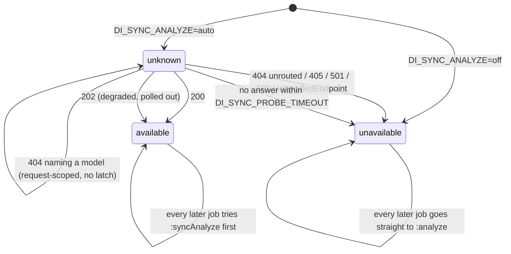

# Container Behaviour

What the two on-prem Azure containers actually do on the wire, as opposed to what their published
contracts say they do. The gateway has to be indistinguishable from them, so wherever a container
contradicts its own documentation the gateway reproduces the container. This document records each
divergence, the evidence behind it, and the code that acts on it — because two of these findings
changed the gateway's design after it was already built, and anyone changing that code needs to
know why it looks the way it does.

---

## 1. Why this document exists

The gateway fronts two containers:

| Surface | Image | Client-facing path |
|---|---|---|
| Document Intelligence `prebuilt-layout`, `api-version=2024-11-30` | `mcr.microsoft.com/azure-cognitive-services/form-recognizer/layout-4.0:2024-11-30` | `/documentintelligence/**` (and `/formrecognizer/**`) |
| Computer Vision Read v3.2, `model-version=2022-04-30` | `mcr.microsoft.com/azure-cognitive-services/vision/read:3.2-model-2022-04-30` | `/vision/v3.2/read/**` |

The design in
[`superpowers/specs/2026-09-08-azure-gateway-api-design.md`](superpowers/specs/2026-09-08-azure-gateway-api-design.md)
was built from Microsoft's REST specs, its published articles, and forensics on the container
images. Then `scripts/probe-containers.sh` was run against a real deployment, and four things came
back different. Two of them were load-bearing — the error shapes (§2) and the declared-but-never-
answering `:syncAnalyze` route (§3) — and the section *What probing a real deployment changed* at
the end of that spec records the resulting design changes.

The important claim is narrow and worth stating plainly: **the published contracts are wrong in
specific ways, and the gateway is built against observed behaviour.** Not "the docs are roughly
right"; the error-shape finding in §2 is the exact opposite of what both swagger definitions
declare, on both surfaces at once.

### Evidence grades used below

Every claim in this document carries one of these. Where a claim is not backed by a recorded
observation, it says so.

| Grade | Meaning |
|---|---|
| `[PROBE]` | Observed by running `scripts/probe-containers.sh` against a live deployment. Recorded in the design spec's final section, in [`../README.md`](../README.md) under *Probe your containers first* and *Why the code looks the way it does*, or in the commit message of `ef625fe`. |
| `[IMAGE]` | Read out of the container image itself — `/app/appsettings.api.json`, compiled route literals, shipped XML docs. Strongest grade for "does this route exist". |
| `[SWAGGER]` | The container's own `/swagger` document, which is authoritative for that exact build and supersedes every Microsoft article where they disagree. |
| `[DOC]` / `[SPEC]` | learn.microsoft.com, or `azure-rest-api-specs`. Present here mostly as the thing being contradicted. |
| `[CODE]` | Verified in this repository's source. Cited by file and function. |
| `[UNRECORDED]` | Checked by the probe script but with no recorded output in this repository. Treat as unverified. |

### How the probe was run

`scripts/probe-containers.sh` needs only `sh` and `curl`, so it runs from a jump host or a debug
pod. It sends a **blank 200×120 white PNG** — above Azure's 50×50 minimum, containing nothing of
yours — never a real document, and prints no API key. Three ceilings shape what its output means,
and they are the source of the wall-clock numbers quoted throughout this document:

| Variable | Default | Bounds |
|---|---|---|
| `SYNC_MAX_SECONDS` | `300` | one analyze call (sync or async submit) |
| `POLL_SECONDS` | `90` | how long an async round trip is waited out before the probe gives up |
| `REQ_MAX_SECONDS` | `30` | everything else |

`gateway probe` (`internal/probe`, wired in `cmd/gateway/main.go:runProbe`) is a smaller equivalent
built into the binary, with a fixed 3-minute overall context and a 2-minute per-request client
timeout. It checks reachability (`/status`, `/ready`), finds each container's swagger, posts the
sample PNG at both analyze routes, asks for an unknown result id, and adds `/info` plus
`/documentModels` on DI and the stale `operations/{id}` alias on Read. The shell script goes
further: it runs the ten deliberate error cases the §2 table is built from, polls an accepted
operation to a terminal state, fetches `analyzeResults/{id}/pdf`, and ends in a verdict block
(`gateway probe` closes with a four-bullet *What to do with this* instead). The shell script is the
one that produced the findings below.

---

## 2. Error shapes

### What the contracts say

- Document Intelligence models `DocumentIntelligenceErrorResponse` with `required: [error]` — every
  error is **wrapped**: `{"error":{"code","message","target","details","innererror"}}` `[SPEC]`.
- Computer Vision Read's two routes are defined in `Ocr.json`, not `ComputerVision.json`, and
  `ComputerVisionOcrError` is **flat**: `{"code","message","requestId"}` with no wrapper, no
  `target`, no `details`, no `innererror` `[SPEC]`.

Each swagger declares exactly one `default` error response covering every non-2xx status, so on
paper the shape is a property of the surface, not of the status code.

### What the containers did

Both containers disagree, in opposite directions `[PROBE]`:

| Surface | Probed case | Status | Shape returned |
|---|---|---|---|
| DI | `GET .../analyzeResults/{unknown id}` | 404 | **flat** — `{"code":"NotFound","message":"Analyze result does not exist."}` |
| DI | `POST :analyze?api-version=1999-01-01` | 4xx | wrapped, with `innererror` |
| DI | `POST .../no-such-model-xyz:analyze` | 4xx | wrapped, with `innererror` |
| DI | `POST :analyze`, text body sent as `application/pdf` | 4xx | wrapped, with `innererror` |
| DI | `GET /documentintelligence/nope` (unrouted) | 404 | **bodyless** |
| Read | `GET /read/analyzeResults/{unknown id}` | 404 | **wrapped** — `{"error":{"code":"BadArgument","message":"Operation ID is invalid, expired or the results matching this operationId have been deleted."}}` |
| Read | `GET /read/analyzeResults/not-a-guid` | 4xx | **wrapped** |
| Read | `POST /read/analyze?readingOrder=sideways` | 4xx | **wrapped** |
| Read | `POST /read/analyze`, text body sent as `image/png` | 4xx | **wrapped** |
| Read | `GET /vision/v3.2/nope` (unrouted) | 404 | **bodyless** |

So: **Document Intelligence drops its wrapper for exactly one response, and Read wraps
everything** — including the four cases its own `Ocr.json` models flat. The DI flat-404 is not
unprecedented; the same divergence has been seen against the cloud service on both `2023-07-31` and
`2024-11-30`, and a Microsoft moderator called it *"a valid difference between documentation and
Service side"* `[DOC]`. What the probe established is that the container does it too, and that Read
inverts in the other direction.

Note also the case that never appears in either error table: **HTTP 200 with `"status":"failed"` in
the body** is the dominant failure mode on both surfaces. Code that switches on HTTP status alone
mis-maps every analysis failure. That is unchanged by anything in this section.

### How the gateway reproduces it

All of this lives in `internal/azerr/azerr.go` `[CODE]`. Two Go types carry the two shapes:
`azerr.Response` (wrapped) and `azerr.ReadError` (flat). Which one a given error renders as is
decided per response by `(*APIError).useFlat`, not per surface:

```go
func (e *APIError) useFlat(s Surface) bool {
	if compat == CompatDocumented {
		// The published contracts: Read is flat, Document Intelligence is wrapped.
		return s == SurfaceRead
	}
	// Observed: both containers wrap, except the one Document Intelligence case that does not.
	return e.flat
}
```

`flat` is an unexported field on `APIError`, and exactly one constructor sets it — `azerr.NotFound`
for the DI surface, which also hard-codes the container's own wording:

| Gateway response | Constructor | Emitted shape (default mode) |
|---|---|---|
| DI unknown or TTL-expired result id | `azerr.NotFound(SurfaceDI)` | flat, `NotFound` / `Analyze result does not exist.` |
| Any other DI error | `azerr.New`, `BadRequest`, `InvalidParameter`, … | wrapped |
| Any Read error, including unknown id | `azerr.NotFound(SurfaceRead)`, `BadRequest`, `InvalidParameter` | wrapped, `BadArgument` (the Read enum contains no not-found code at all) |
| Read overload / unavailable / bad media type | `azerr.TooBusy`, `Unavailable`, `UnsupportedMediaType` | wrapped, but `InvalidRequest` / `Unspecified` / `UnsupportedMediaType` respectively — **not** `BadArgument` |
| Unrouted path, either surface | `azerr.Unrouted` | 404, `Content-Length: 0`, no body |

`Unrouted` sets `bare`, and `WriteTo` short-circuits before rendering any body — so an unrouted path
is bodyless regardless of compat mode. `internal/app:unrouted` is registered on `"/"` and
picks the surface from the path prefix (`surfaceFor`), so the bodyless 404 is what any unmatched
path gets. This is safe precisely because it is unrouted: no SDK parses an unrouted response as
operation state, and every *routed* endpoint still returns a body.

Regression coverage: `TestObservedShapesMatchTheContainers` and `TestUnroutedIsBodyless` in
`internal/azerr/azerr_test.go`, and `TestUnknownIDMatchesTheContainersNotTheSpec` in
`test/conformance/fidelity_test.go`. `internal/mockazure`'s `writeUnknownID` fakes both shapes, so
the whole thing is provable on a laptop.

### What `ERROR_COMPAT=documented` is for

`ERROR_COMPAT` (`internal/config/config.go`, default **`observed`**, validated to be one of
`observed` / `documented`) selects between the two. `cmd/gateway/main.go` calls
`azerr.SetCompat(azerr.CompatDocumented)` once at startup when it is set, before anything is served.

`observed` is the default because being indistinguishable from the container is the entire product:
a client that today parses the container's flat DI 404 must keep working when the gateway is
dropped in front of it.

`documented` exists for the opposite client — one written against the **generated SDK models**
rather than against these containers. `azure-ai-documentintelligence`'s model expects
`{"error":{…}}` for every DI error; `azure-cognitiveservices-vision-computervision`'s expects a flat
`ComputerVisionOcrError` for every Read error. In `documented` mode DI wraps everything (including
the unknown id) and Read is flat everywhere, which is what those models deserialise cleanly.
Covered by `TestDocumentedCompatFollowsTheSpecs` and
`TestDocumentedCompatRestoresTheSpecShapes`.

The active mode is visible on `/_gw/config`: `Config.Redacted()` emits `errorCompat`, and
`cmd/gateway/main.go` derives `azerr`'s compat state from that same field at startup, so the two
cannot drift `[CODE]`. What is reported is therefore the configuration, not `azerr`'s own state —
`azerr.CompatMode()`, whose comment says it exists "for the admin surface", still has no callers.

### Reading errors the other way

The gateway also has to *parse* what the containers send it. `azerr.ParseUpstream` tolerates all
four shapes these containers are known to produce — DI wrapped, DI flat, Read flat, and the bare
`{"status":"Failed"}` (capital F, no code, no message) documented for CV `syncAnalyze` — and returns
`ok=false` for anything else, including an empty body and the HTML an nginx sidecar produces. The
caller then synthesises a well-formed error rather than relaying bytes no SDK can parse
(`(*base).readErrorBody` and `(*base).genericError` in `internal/upstream/client.go`).

---

## 3. The synchronous route

### What `:syncAnalyze` is

The gateway's happy path is a synchronous upstream call, because a synchronous call mints no
operation id and therefore survives a pod rescheduling that would strand an async one.

- **Read's** synchronous route, `POST /vision/v3.2/read/syncAnalyze`, is documented `[DOC]` —
  *"Synchronous operations are only supported in containers."*
- **Document Intelligence's**, `POST /documentintelligence/documentModels/{modelId}:syncAnalyze`,
  is **undocumented**. It appears in no learn.microsoft.com article and occurs zero times in
  `azure-rest-api-specs`. It was found by forensics on the container image `[IMAGE]`:
  `"SyncAnalyzePath"` in `/app/appsettings.api.json`, a compiled route literal in
  `Microsoft.CloudAI.Containers.VDI.Endpoint.Analyze.dll`, and the MVC action
  `AnalyzeController.SynchronousAnalyze`.

There is no SDK method for either. Both have to be hand-rolled raw HTTP.

### What the probed build actually did

On the deployment that was probed, the DI container **declared `:syncAnalyze` in its own swagger and
never answered it** `[PROBE]` `[SWAGGER]`. The connection stayed open until the probe's own
`SYNC_MAX_SECONDS` ceiling of 300 seconds expired, on a blank 200×120 PNG.

That is a state the design had not anticipated. It had planned for *present* and for *absent*; a
route that is declared, accepts the request, and then holds the connection is neither. The
consequence was concrete: the `:syncAnalyze` attempt inherited `DI_UPSTREAM_TIMEOUT` (default
**15m**), so in `auto` mode **every job would have waited fifteen minutes on a route that never
answers before falling back to the route that works.**

### The three states a build can be in, and how the gateway detects each

`(*DIClient).trySync` in `internal/upstream/di.go` switches on the response and maps it onto one of
three outcomes `[CODE]`:

| State | What the container does | Detection | Result |
|---|---|---|---|
| **Serves it** | `200` with the analysis | `http.StatusOK` → `capability = syncAvailable`; body is streamed to a scratch file and `inspectOperation` locates `analyzeResult` | `store.ModeSync`. Nothing is pinned to a replica. |
| **Degrades** | `202` + `Operation-Location` under memory pressure — Microsoft has called the 202 on this route *"not standard or documented behavior"* `[DOC, field-reported on 3.1]` | `http.StatusAccepted` → capability still recorded as *available*; the operation id is extracted and polled out on the **same connection and cookie jar** | `store.ModeDegraded` |
| **Does not serve it, or never answers** | `404` (Kestrel unrouted), `405`, `501`, `500 UnhandledEndpointException` on older builds, **or nothing at all** | `ErrSyncUnavailable` → capability latches to `syncUnavailable` process-wide | `store.ModeAsyncFallback`: `:analyze` + affinity polling, permanently |

Two of those detections are deliberately careful:

- **A 404 is ambiguous**, and getting it wrong is expensive in one direction, because the latch is
  process-wide and permanent. `resourceScoped404` distinguishes "this route is not served" from
  "this route is served and your model does not exist": a well-formed DI error naming the model
  (`innererror.code` of `ModelNotFound` or `OperationNotFound`, or a `NotFound` with a message) is a
  request-scoped failure and is returned to the caller; anything else disables the route. Without
  this, one request naming a missing model would have disabled the fast path for every later job
  until the pod restarted. Covered by `TestResourceScoped404DoesNotDisableTheSyncRoute`.
- **A 500 is ambiguous too.** `looksLikeMissingEndpoint` inspects the body for
  `unhandledendpointexception`, `no candidates found for the request path`, or `request did not
  match any endpoints`, which is how older builds spell "no such route"; anything else is a genuine
  analysis failure and is reported as one.



The state is an `atomic.Int32` on `DIClient` and is **process-local and one-way**: the route either
exists on an image build or it does not, so it is never re-probed after latching off. It resets only
on restart. `/_gw/health` reports it per upstream as `syncAnalyze: unknown | available | unavailable`
(`(*DIClient).capabilityName`).

### `DI_SYNC_PROBE_TIMEOUT`

This is the setting the hung-route finding produced.

| Setting | Default | Purpose |
|---|---|---|
| `DI_SYNC_PROBE_TIMEOUT` | **`60s`** | Ceiling on how long a background job waits for `:syncAnalyze` to *answer*. It does not bound the result download that follows, and it does not apply to the client-facing `:syncAnalyze` passthrough at all — that is a straight proxy and inherits `DI_UPSTREAM_TIMEOUT`. |
| `DI_UPSTREAM_TIMEOUT` | `15m` | Ceiling on one complete logical analysis, fallback polling included |

`trySync` wraps the attempt in its own `context.WithTimeout(ctx, c.probeTimeout)`, and reads the
outcome carefully:

- transport error with the **caller's** context cancelled → return the caller's error. A client
  hanging up is not a verdict on the route.
- transport error with the **probe's** context expired → `ErrSyncUnavailable`, and the capability
  latches off.

On the degraded 202 path the follow-up poll is deliberately given `ctx`, **not** `probeCtx` — the
probe bound covers deciding whether the route answers, not how long the analysis it accepted may
take. `NewDI` clamps the probe timeout down to `DI_UPSTREAM_TIMEOUT` if it is set larger or
non-positive, so it can never be the longer of the two.

`DI_SYNC_ANALYZE` (`auto` | `force` | `off`, default `auto`) sits on top: `off` pre-latches the
capability to unavailable at construction, so no job pays even the first probe; `force` turns
`ErrSyncUnavailable` into a hard 500 rather than falling back, which is the mode to use when you
have confirmed the route works and want to be told loudly if that changes.

`internal/mockazure` has a `SyncHang` behaviour that reproduces the probed container exactly —
accepts and never answers — and `TestHungSyncRouteFallsBackQuickly` asserts both halves of the fix:
the first job completes without waiting out `DI_UPSTREAM_TIMEOUT`, and a second job does not probe
the route again.

### The Read side

Read always calls `syncAnalyze` first (design decision D6). It has **no capability latch**: a `404`
or `405` there is treated as a misconfigured upstream rather than an image difference, because the
route is documented for every 3.2 build, so `(*ReadClient).Analyze` falls back to
`:analyze` + polling for that one job `[CODE]`.

Nothing records that fallback at the surface level, though. `(*ReadClient).Health` sets
`SyncAnalyze = "available"` unconditionally — its comment says the route is documented for this
container, so it is reported rather than probed — which means `/_gw/health` reads identically
whether the route answered or 404'd. The only trace is `upstreamMode=async-fallback` on that job in
`/_gw/jobs`, and `mode=async-fallback` on its *job succeeded* log line.

Read's degraded-202 path shares the poll loop and has its own budget, `READ_BLIND_POLL_BUDGET`
(default `60`). It originally borrowed the Document Intelligence one; a DI-named variable silently
governing Read behaviour was a surprise an operator should not have to discover, so the two are now
separate.

---

## 4. What the containers do not send

Two headers that the gateway emits and the containers are not relied on to emit at all.

### `Retry-After`

The DI spec declares `Retry-After` on the 202 `[SPEC]`; the CV Read container documentation's header
dump for its 202 lists none `[DOC]`. The shell probe records the value on both submits, but reads
them unevenly: the Document Intelligence submit prints `(absent)` for a missing header, the Read
submit prints an empty value instead, and `gateway probe` prints the header only when it is
non-empty. So a run tells you what you have on DI, and on Read only if you look closely. **No
recorded probe output in this repository shows either container emitting one** `[UNRECORDED]` —
`docs/api-surface.md` §11 grades this Q-X3 *partially verified*.

The gateway therefore never depends on an upstream `Retry-After`, in either direction:

- **Emitting**: `httpx.SetRetryAfter` writes integer seconds on the 202 and on every in-progress
  poll, using `POLL_RETRY_AFTER` (default **`1`**, validated `>= 1`). `azerr.TooBusy` attaches
  `BUSY_RETRY_AFTER` (default **`5`**) to a 429.
- **Consuming**: `retryAfterSeconds` in `internal/upstream/poll.go` parses an integer upstream
  value, and `pollUntilTerminal` adopts it as the next backoff, clamped to the loop's 5-second
  maximum; an HTTP-date is ignored rather than approximated (`retryAfterSeconds` returns 0 for it),
  and an absent header just leaves the loop's own 500ms→5s exponential backoff in charge.

Why the SDKs need the gateway to emit it:

| Client | Behaviour without / with a bad header |
|---|---|
| Python `azure-ai-documentintelligence` | With **no** header, azure-core's poller sleeps its `polling_interval` default of **30 s** between polls — a job that finishes in 1 s is observed as taking 30. With an **HTTP-date**, the DI client runs the header through `self._deserialize("int", …)` and raises `DeserializationError`, failing the call outright. |
| .NET | `int.TryParse`, so an HTTP-date is silently ignored; takes `Max(RetryAfter, backoff)`, so the header can only lengthen the interval, never shorten it. |
| JS | Retries a 429 or 503 **only** when a retry-after header is present and parseable. Without one, a 429 is not retried at all — which is why `azerr.TooBusy` always carries it. |

And the rule that runs the other way: **never attach `Retry-After` to a non-retriable status.**
azure-core's `RetryPolicy` retries *any* response `>= 400` that carries the header, bypassing its own
method allowlist, up to `retry_total = 10`. A 404 with a `Retry-After` gets hammered eleven times.
`azerr.retriable` enforces this — `WriteTo` only emits the header for 408, 429, 500, 502, 503 and
504, whatever the caller asked for — and `(*Server).relaySync` in `internal/surface/di.go` explicitly
zeroes an upstream `Retry-After` before re-adding its own on a retriable status. Covered by
`TestRetryAfterOnlyOnRetriableStatuses`, `TestNoRetryAfterOnNonRetriableErrors` and
`TestRetryAfterIsIntegerSeconds`.

### `apim-request-id`

This is a cloud front-door header. `docs/api-surface.md` §11 Q-A7 grades it *UNVERIFIED — assume no*
for the container. Only the shell probe's Document Intelligence submit captures it, alongside
`Retry-After`; the Read submit and `gateway probe` never read it at all. Again, **no recorded output
in this repository shows a container emitting one** `[UNRECORDED]`.

The gateway emits one on **every** response: `httpx.RequestID` middleware mints a fresh GUID
(`ids.New()`) and sets `apim-request-id` before the handler runs, then binds a request-scoped logger
carrying it. No SDK requires it — the only reference in any Azure SDK tree is .NET adding it to
`Diagnostics.LoggedHeaderNames` — so this is cosmetic realism plus a log correlation key that costs
nothing.

The header that does matter operationally is `x-ms-client-request-id`: SDKs send it and expect it
echoed. The middleware echoes it back and adds it to the log line, which is the only way to line up
a client's trace with a gateway log entry when someone reports a stuck operation. Covered by
`TestClientRequestIDIsEchoed`.

---

## 5. Routes

What the probed build served, and what the gateway does about it.

| Route | Observed | Gateway |
|---|---|---|
| `/formrecognizer/**` | **Served alongside `/documentintelligence/**`** `[PROBE]` `[IMAGE]` | Served. `internal/surface/di.go:registerDI` registers all nine routes on both prefixes: the six analyze and result routes on the same handlers, plus the three metadata proxies (`/info`, `/documentModels`, `/documentModels/{modelId}`), which reach the container on whichever family the caller used. Covered by `TestLegacyFamilyServesTheMetadataRoutes` |
| `GET /documentintelligence/info` | **404** on that build `[PROBE]` | Proxied, and the container's own 404 reaches the client — see below |
| `GET /documentintelligence/documentModels` | **404** on that build `[PROBE]` | Proxied — same |
| `GET /vision/v3.2/read/operations/{id}` | Not served `[UNRECORDED]`; the probe checks it, and every source except one stale install-doc paragraph says `analyzeResults` | **Not served.** `registerRead` registers only `analyze`, `syncAnalyze` and `analyzeResults`; the alias falls through to the bodyless 404 |
| `GET .../analyzeResults/{id}/pdf` | **200 with `application/json`** `[PROBE]` | Fetched artifact is checked against its media type before being stored — see below |
| `POST .../{modelId}:analyzeBatch` | n/a | Rejected with a 400 explaining it needs Azure Blob Storage; unusable air-gapped |
| `DELETE /vision/v3.2/read/analyzeResults/{id}` | n/a | **Not served.** The Read contract does not define it. Asserted by `TestReadSurfaceHasNoDeleteRoute`. DELETE exists only on the DI surface, where it is served by `diDelete` |

### `/formrecognizer/**`

This family was an explicit non-goal in the original design and is now served, purely because the
container serves it: a client on `azure-ai-formrecognizer` reaches the container today and would
have hit a 404 on a gateway that only served the newer prefix.

The subtlety is that the prefix cannot simply be normalised away. Every SDK family derives the
operation id from `Operation-Location` with a regex that hard-codes **its own** family — the DI
clients use `[^:]+://[^/]+/documentintelligence/.+/([^?/]+)`. So the prefix a caller arrived on is
carried all the way through: `prefixOf(r)` → `submitParams.upstreamPrefix` → `store.Job.Prefix` →
`upstream.Request.Prefix` → `prefix()` in `internal/upstream/di.go`, and back out through
`diOperationLocation(base, prefix, …)`. A caller that arrives on `/formrecognizer` is answered on
`/formrecognizer` and the container is called on `/formrecognizer`. Covered by
`TestLegacyFormRecognizerPrefixIsServed`, and — for the metadata routes an SDK calls before it
analyses anything — `TestLegacyFamilyServesTheMetadataRoutes`.

The same prefix must also carry the *result-file* fetches. `store.Job.Prefix` is persisted for
exactly that reason, and `FetchArtifact` once ignored it and hard-coded `/documentintelligence`,
so a legacy job's searchable PDF and figures were fetched from a family the operation was never
issued in and silently lost to a 404.

One thing the gateway does *not* do: the two families accept different `api-version` sets on the
container — `documentintelligence` takes `2024-11-30` and neighbours, `formrecognizer` takes
`2022-03-31-preview` … `2023-07-31` `[IMAGE]`. `requireAPIVersion` only checks that the parameter is
present and non-empty, then forwards it verbatim, so a mismatched pair produces the container's own
*"api-version is invalid"* error rather than a gateway-side rejection.

The timing differs from a direct call, though, and only on the asynchronous submit. The gateway
answers `202` with an `Operation-Location` before it has spoken to the container at all — that is
the whole point of the design — so the container's `400` cannot be the response to the submit. It
surfaces on the next poll instead, as a `failed` operation at HTTP `200` carrying the container's
own message. A direct caller sees the 400 immediately; a gateway caller sees the same diagnosis one
poll later. On the synchronous passthroughs, where the gateway holds no promise, it is relayed
as-is.

### `/info` and `/documentModels` returning 404

These are metadata proxies (`(*Server).proxyGET` → `PassthroughGET`), admitted against a separate
metadata pool and bounded by a hard-coded `metadataTimeout` of 10 seconds so a wedged container
cannot turn a cheap GET into a 15-minute hold.

Be precise about what a client sees when the container 404s them. `(*Server).relaySync` normalises
every non-2xx, and in all three cases the container's own status survives `[CODE]`:

- a body `azerr.ParseUpstream` recognises → the upstream status **and** code are preserved;
- an **empty** body — Kestrel's bodyless 404, which is what a probed layout-4.0 build answers on
  these two routes, having declared neither in its swagger — → the upstream headers are copied,
  `Content-Length: 0` is set, and `resp.StatusCode` is written through untouched;
- a non-empty body nothing can parse — HTML from an nginx sidecar — → `azerr.ForStatus(surface,
  resp.StatusCode, "")`, a well-formed error object at the container's own status, carrying this
  surface's code for it — `NotFound` on DI — and the message *"The upstream container returned
  HTTP 404."*

So a client always sees the container's 404 as a 404. Synthesising a 500 there was the earlier
behaviour, and it was wrong in the most misleading way available: it turned a correct container
answer into a gateway fault. `ForStatus`'s doc comment says exactly that, and two regression tests
in `test/conformance/sync_test.go` hold the halves apart —
`TestProxyPreservesUpstreamStatus` drives `/info` and `/documentModels` against a `MetadataMissing`
mock and requires a 404 with a zero-byte body, and `TestProxyNormalisesUnparseableUpstreamBody`
requires an unparseable body to keep the container's own status.

### `analyzeResults/{id}/pdf` answering `200 application/json`

The searchable-PDF and cropped-figure endpoints are addressed by the **container's own** operation
id, whose lifetime is the container's `StorageTimeToLiveInMinutes` and whose owning replica can
disappear at any time. So the gateway fetches them eagerly at job completion rather than proxying
them on demand (`(*Manager).fetchArtifacts` in `internal/jobs/manager.go`), and serves them from its
own store afterwards.

The probe found this route answering `200` with `Content-Type: application/json` `[PROBE]`. Storing
that as a PDF would hand a client a file that is not one, under the wrong `Content-Type`, and look
like a successful capture. So the fetched body is checked before it is stored:

```go
case !isPDF(ct):
	log.Warn("result-file endpoint did not return a pdf; not storing it", "contentType", ct)
	_ = os.Remove(path)
```

`isPDF` parses the media type with `mime.ParseMediaType` and requires exactly `application/pdf`. A
rejected artifact is simply absent, and a later `GET .../pdf` on that operation returns a clean
gateway 404 — a much better outcome than serving JSON labelled as a PDF.

Two related notes. A submit carrying `output=pdf` or `output=figures` sets
`Request.RequireOperation` (`wantsArtifacts`), which forces the **asynchronous** upstream path even
when `:syncAnalyze` is available, because a synchronous call never mints the operation id these
endpoints are addressed by. And the whole artifact phase has one aggregate budget,
`ARTIFACT_FETCH_TIMEOUT` (default `2m`), so N figures against a wedged container cannot become N
times the per-request timeout.

---

## 6. The `vision` substring bug

When the inbound request authority contains the substring `vision`, the Read container rebuilds its
own callback URL with a naive string operation and corrupts it, **stripping both the port and the
`/vision` path segment**:

```
POST http://azure-vision:5000/vision/v3.2/read/analyze
  -> Operation-Location: http://azure-vision/v3.2/read/analyzeResults/{id}
```

`http://azure-vision/v3.2/read/analyzeResults/{id}` is not a route on anything: wrong port, and the
`/vision` segment the route lives under is gone.

**The gateway is immune, and not by accident.** It never propagates a container's
`Operation-Location`:

- `operationIDFrom` (`internal/upstream/poll.go`) keeps only the trailing identifier and discards
  the rest of the header;
- poll targets are rebuilt against the configured upstream base — `(*ReadClient).pollURL`,
  `(*DIClient).pollURLIn`;
- the client-facing header is minted from scratch by `readOperationLocation` /
  `diOperationLocation`;
- `skipRelayHeader` drops `Operation-Location` (and `Location`, and `Set-Cookie`) from any
  passthrough response, so a corrupted header cannot leak through the synchronous route either.

**The deployment rule it implies:** the Read container's DNS authority — Kubernetes Service name,
compose service name, DNS label — must not contain `vision`. Anything calling the container directly
breaks, and anyone debugging it will lose an afternoon. The gateway enforces this as a **startup
warning, not a fatal error**, because the gateway itself still works:
`config.ErrReadHostContainsVision` is raised by `(*Config).Warnings()` when
`strings.Contains(strings.ToLower(u.Hostname()), "vision")`, and logged at `Warn` by
`cmd/gateway/main.go`. Both the shell probe and `internal/probe` print the same warning, and the
probe's verdict block ends with `READ host has "vision"  yes|no`.

---

## 7. Failure detail on a failed Read operation

The Read operation envelope has **no `error` member in its schema at all** `[SPEC]`. A failed Read
operation is documented as nothing more than `{"status":"failed","createdDateTime":…,
"lastUpdatedDateTime":…}`. Taken literally, that means a failed Read is undiagnosable.

The container does better than its schema: it carries the detail in **`analyzeResult.errors[]`**
`[PROBE]`. So `inspectOperation` in `internal/upstream/poll.go` looks in both places, in order:

1. a top-level `error` member — where **Document Intelligence** puts it;
2. failing that, `firstResultError` locates the `errors` member *inside* the `analyzeResult` byte
   range and lifts `[0].code` / `[0].message` out — where **Read** puts it;
3. failing both, a generic `azerr.Internal(surface, "The upstream container reported the analysis as
   failed.")`.

Before this finding, step 2 did not exist and a failed Read lost its diagnosis to the generic
message in step 3.

Both lookups are byte-range reads over the file, never a full parse — the result may be hundreds of
megabytes — and both are bounded (`maxErrorBody` = 64 KiB for the top-level error, 1 MiB for the
`errors` array) so a misbehaving upstream cannot pin memory.

What the client then sees: the gateway's own poll response for a failed job is **HTTP 200** with
`"status":"failed"` and an `error` object, on **both** surfaces. Including it on Read deviates from
the Read schema deliberately: generated SDK models ignore unknown properties, and a failure with no
diagnostics is exactly the dead end the container's own bare `{"status":"Failed"}` creates. The
comment in `(*Server).poll` in `internal/surface/surface.go` says so. Related: the bare
`{"status":"Failed"}` — capital F, no code, no message — that CV `syncAnalyze` produces is matched
case-insensitively by `azerr.ParseUpstream` and by `isFailed` on every path that *interprets* it.
It is not rewritten on the client-facing synchronous passthroughs: the container returns it at HTTP
200, and `relaySync` streams every 2xx through untouched by design, so a client calling
`:syncAnalyze` or `/read/syncAnalyze` directly receives that body verbatim. That is faithful — it is
what the container itself would have sent — but a passthrough caller, unlike a polling one, gets no
code and no message to act on.

---

## 8. Performance observed

The probed deployment's layout container left a **blank 200×120 PNG still `running` after 90
seconds** `[PROBE]` — that is the probe's `POLL_SECONDS` ceiling, so the true figure is "at least 90
seconds", not "90 seconds".

For scale, Microsoft's own published benchmark basis for the Read container is *"a single request
per second, using a 523-KB image of a scanned business letter that contains 29 lines and a total of
803 characters"* `[DOC]`. A blank 200×120 PNG is orders of magnitude less work than that, and it did
not finish in 90 seconds.

**State this plainly: that is a container resourcing question, not a gateway one.** The documented
minimums are:

| Container | Minimum | Recommended | Other |
|---|---|---|---|
| DI Layout | 8 cores / 16 GB | 8 cores / 24 GB | ≥ 2.6 GHz, x64 Linux only |
| CV Read 3.2 | 4 cores / 8 GB | 8 cores / 16 GB | host **must** support AVX2 — *"the container will not function correctly without AVX2 support"* |

The containers have no concurrency knob and never emit `429`; they do not cap TPS. Under overload
they degrade rather than reject: latency climbs unboundedly, RSS climbs, and then either
`HealthCheck:MemoryUpperboundInMB` trips — the container reports unhealthy to liveness, the kubelet
restarts the pod, and every in-flight and stored-but-unretrieved result on it is destroyed — or the
cgroup OOM killer fires. `Task:MaxRunningTimeSpanInMinutes` (60 minutes) is the only backstop.

Nothing the gateway can configure fixes that. What it can do is stop waiting sooner and stay
truthful while it waits, which is what these bounds are for:

| Setting | Default | Bounds |
|---|---|---|
| `DI_SYNC_PROBE_TIMEOUT` | `60s` | how long a background job waits for `:syncAnalyze` to answer (not the download, and not the client-facing passthrough) |
| `DI_UPSTREAM_TIMEOUT` | `15m` | one complete DI analysis, fallback polling included |
| `READ_SYNC_TIMEOUT` | `10m` | one complete Read analysis |
| `ARTIFACT_FETCH_TIMEOUT` | `2m` | the whole result-file phase of one job |
| `UPLOAD_TIMEOUT` | `10m` | how long a client may hold an admission slot streaming its body |
| `DI_MAX_INFLIGHT` / `READ_MAX_INFLIGHT` | `4` each | concurrent upstream calls per surface; the slot is held from admission to completion |

If a container is starved, the correct move is to give it its cores and RAM — or, per
`docs/api-surface.md` §9.4, to cut large documents into small `pages=` ranges, which is worth roughly
15–30× on big PDFs and is something the Layout container will not do for you. Raising
`DI_UPSTREAM_TIMEOUT` only makes the gateway wait longer for the same answer.

One deployment constraint interacts with all of this: **OpenShift Routes default to a 30-second
HAProxy timeout**, and a synchronous call holds the connection for the whole analysis. Set
`haproxy.router.openshift.io/timeout` to match your `READ_SYNC_TIMEOUT` / `DI_UPSTREAM_TIMEOUT`, or
every large synchronous request dies at 30 s regardless of what the containers do. See
[`OPERATIONS.md`](OPERATIONS.md).

---

## 9. Re-verifying on a new image build

Every finding above is about **one build on one cluster**. A new image tag, or a different cluster,
can move any of them. Re-run the probe before you trust this document against a new deployment.

```sh
DI_UPSTREAM_URL=http://layout:5000 \
READ_UPSTREAM_URL=http://ocr:5000 \
  ./scripts/probe-containers.sh
```

`make probe` runs exactly that; `make probe-go` runs `gateway probe`, the in-binary equivalent. It
costs roughly ten analyses per container, sends only the blank PNG and a 14-byte throwaway text
file — used for the two wrong-content-type error cases — and prints no API key. If
`:syncAnalyze` comes back `000 / TIMED OUT` while the swagger declares it, re-run with
`SYNC_MAX_SECONDS=600` before concluding anything — that is the state §3 is about.

The single most valuable thing the run does is pull each container's own `/swagger` document. That
document is authoritative for your exact build and supersedes every Microsoft article where they
disagree.

### Finding → configuration decision

The verdict block at the end of the run carries most of this; the rows marked *(row)* appear in the
body of the report rather than in the verdict.

| Probe output | Finding | What it decides |
|---|---|---|
| `DI :syncAnalyze  AVAILABLE` | Route serves and answers | Keep `DI_SYNC_ANALYZE=auto`. Fast path works |
| `DI :syncAnalyze  DEGRADES TO 202` | Route answers but goes async under load | Keep `auto`. The gateway polls the 202 out with affinity; watch `upstreamMode=degraded-202` on `/_gw/jobs` |
| `DI :syncAnalyze  ABSENT (404)` / `ABSENT (500)` | Build does not serve it | Set `DI_SYNC_ANALYZE=off` to skip a wasted call per job |
| `DI :syncAnalyze  NO ANSWER: TIMED OUT` **and** `DI in swagger  declared` | Declared and hangs — the probed build's state | `DI_SYNC_PROBE_TIMEOUT` caps the damage automatically; set `DI_SYNC_ANALYZE=off` to remove it entirely |
| `DI 200 body shape  envelope` / `bare AnalyzeResult` | Whether the 200 wraps the result | Nothing to configure — `inspectOperation` handles both shapes |
| `DI error shape  flat` (unknown id) | DI drops its wrapper for this one response | Keep `ERROR_COMPAT=observed`. Switch to `documented` only for clients written against the generated SDK models |
| `READ error shape  wrapped` | Read wraps everything, contradicting `Ocr.json` | Same decision, same setting |
| `READ operations alias  404` | Only `analyzeResults` is served | Nothing to configure — the gateway serves only `analyzeResults` |
| `READ host has "vision"  yes` | The `Operation-Location` corruption bug is live | Rename the upstream Service. The gateway warns at startup and works anyway; direct callers do not |
| `DI result-file /pdf  200`, with `ct=application/json` on the `analyzeResults/{id}/pdf` row *(row)* | Artifact endpoint lies about its media type | Nothing to configure — `isPDF` refuses to store it |
| `GET /info`, `GET /documentModels` 404 *(row)* | Metadata endpoints absent on this build | Nothing to configure. The gateway relays the container's 404: a bodyless upstream 404 stays a bodyless 404, and a well-formed upstream error keeps its status and code (§5) |
| `status=running after 90s` on the `analyzeResults/{id}` row *(row)* | Container is slow or starved | Size the container (§8). Do not raise `DI_UPSTREAM_TIMEOUT` and call it fixed |

---

## Related documents

| Document | Covers |
|---|---|
| [`../README.md`](../README.md) | Operator quick start, full environment-variable table, route inventory |
| [`ARCHITECTURE.md`](ARCHITECTURE.md) | Package structure, the async lifecycle the gateway owns, persistence |
| [`OPERATIONS.md`](OPERATIONS.md) | Deployment, the OpenShift Route timeout, health and readiness, tuning |
| [`TESTING.md`](TESTING.md) | The conformance suite, `internal/mockazure`, the real-SDK harness |
| [`HANDOFF.md`](HANDOFF.md) | State of the work and what is still open |
| [`api-surface.md`](api-surface.md) | The full container contract with per-claim citations, and the open questions the probe settles |
| [`superpowers/specs/2026-09-08-azure-gateway-api-design.md`](superpowers/specs/2026-09-08-azure-gateway-api-design.md) | The approved design, the adversarial review outcomes, and *What probing a real deployment changed* |
