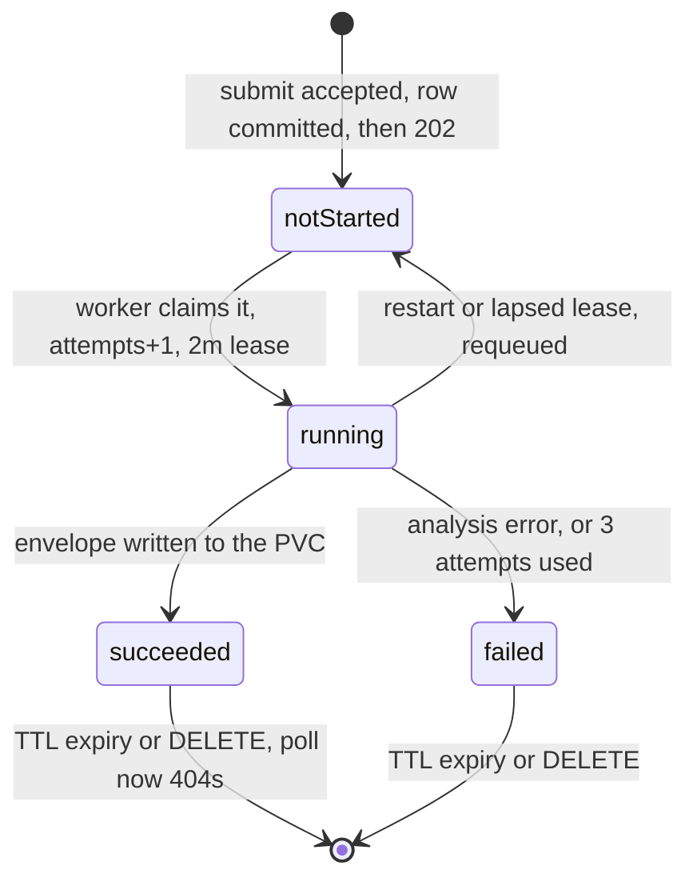

# Operations

This is the runbook for deploying and running `azure-gateway-api`: what to check before you
deploy, how to configure it, what to watch, and what to do when something breaks. Every default
and every behaviour described here was read out of the source — env var defaults come from
[`internal/config/config.go`](../internal/config/config.go), metric names from
[`internal/admin/admin.go`](../internal/admin/admin.go), and so on — so where this document and a
blog post disagree, this document is describing the binary you are actually running. For what the
gateway *is* and why, start at [`../README.md`](../README.md); for how it works inside, see
[`ARCHITECTURE.md`](ARCHITECTURE.md).

---

## 1. Before you deploy: probe the containers

The gateway's fast path depends on `POST /documentintelligence/documentModels/{modelId}:syncAnalyze`,
a route that exists in the container image's routing table and in no Microsoft documentation.
Some builds serve it, some 404 it, some declare it in their own swagger and then never answer it.
The probe tells you which one you have before you tune anything.

```sh
DI_UPSTREAM_URL=http://layout.ai.svc.cluster.local:5000 \
READ_UPSTREAM_URL=http://ocr-read.ai.svc.cluster.local:5000 \
DI_UPSTREAM_API_KEY=… READ_UPSTREAM_API_KEY=… \
./scripts/probe-containers.sh
```

It needs `sh` and `curl` and nothing else, so it runs from a jump host or a debug pod in the
namespace without building anything. `make probe` is the same script;
`make probe-go` runs the equivalent built into the binary (`gateway probe`, bounded at three
minutes overall by [`cmd/gateway/main.go`](../cmd/gateway/main.go)). The script sends a blank
200×120 white PNG, never one of your documents, prints no API key, and writes nothing outside a
temp directory. It costs roughly ten analyses per container, billed like any other query.

Useful knobs: `SYNC_MAX_SECONDS` (default `300`) is the per-request ceiling on an analyze,
`POLL_SECONDS` (default `90`) how long it waits for an async round trip, `MODEL_ID` (default
`prebuilt-layout`) and `API_VERSION` (default `2024-11-30`).

### A sample verdict

This is the shape the script ends with. The values below are the ones one real deployment
produced — a container that declares `:syncAnalyze` in its own swagger and then holds the
connection open past five minutes on a blank image:

```
-----------------------------------------------------------------------------
VERDICT
-----------------------------------------------------------------------------
  DI   :syncAnalyze     NO ANSWER: TIMED OUT after 300s
  DI   in swagger       declared
  DI   :analyze         202
  DI   result-file /pdf  200
  DI   error shape      flat
  READ syncAnalyze      AVAILABLE
  READ /read/analyze    202
  READ error shape      wrapped
  READ operations alias 404   (not served, as expected)
  READ host has "vision" no

  -> inconclusive. If the swagger declares it, the route exists and is
     slow; re-run with SYNC_MAX_SECONDS=600 before deciding.
  -> DI errors are flat, not the wrapped shape its SDK models expect.
  -> READ errors are wrapped, not the flat shape its SDK models expect.
```

### What each line means for your configuration

| Verdict line | Value | What to do |
|---|---|---|
| `DI :syncAnalyze` | `AVAILABLE` | Leave `DI_SYNC_ANALYZE=auto`. Jobs run stateless and nothing is pinned to a replica. |
| | `DEGRADES TO 202` | Leave `auto`. The gateway polls the operation out with connection and cookie affinity; expect `upstreamMode: degraded-202` on `/_gw/jobs`. |
| | `ABSENT (404)` / `ABSENT (500)` | Set `DI_SYNC_ANALYZE=off`. The gateway would latch it off by itself after the first job; setting it saves one wasted round trip on that job and makes the intent explicit. |
| | `NO ANSWER: TIMED OUT …` | The route exists and hangs. In `auto` mode only the *first* job pays `DI_SYNC_PROBE_TIMEOUT` (60s) before the capability latches off process-wide — but set `DI_SYNC_ANALYZE=off` once you have confirmed it, so a restart does not pay that minute again. |
| `DI in swagger` | `declared` / `not declared` | On its own, decides nothing. A build can declare the route and never answer it, and DI's route is undocumented, so its absence here proves nothing either. Read it together with the line above. |
| `DI 200 body shape` | `envelope (.analyzeResult present)` or `bare AnalyzeResult (no envelope)` | No configuration. `inspectOperation` in [`internal/upstream/poll.go`](../internal/upstream/poll.go) handles both: an object with no `status` member is treated as a bare result. |
| `DI :analyze` | `202` | Expected. Anything else means the fallback path is broken too, and no DI job will complete. |
| `DI result-file /pdf` | HTTP status | Anything but `200` means `output=pdf` submissions will store nothing and the gateway will 404 `.../pdf`. A probed container answered `200` with `application/json`; the gateway checks the media type and refuses to store a non-PDF, logging `result-file endpoint did not return a pdf`. |
| `DI error shape` | `flat` | Matches the default `ERROR_COMPAT=observed`: DI drops its wrapper for exactly one response, the unknown or expired result id. |
| | `wrapped` | Your build follows the published contract. Consider `ERROR_COMPAT=documented`, and re-check with a real client. |
| `READ syncAnalyze` | `AVAILABLE` | Expected — it is documented for every 3.2 build. The gateway uses it for every Read job. |
| | anything else | The gateway falls back to `/read/analyze` plus polling on its own, but this means a misconfigured upstream rather than an image difference. Check the URL. |
| `READ /read/analyze` | `202` | Expected. |
| `READ error shape` | `wrapped` | Matches `ERROR_COMPAT=observed`: Read wraps every error, including the ones its own `Ocr.json` models as flat. |
| `READ operations alias` | `404` | Expected. `/read/operations/{id}` is stale text in an old install article; only `analyzeResults` is served. |
| `READ host has "vision"` | `yes` | Rename the Service. See [§3](#3-two-openshift-constraints-microsofts-docs-do-not-mention). |

`docs/CONTAINER-BEHAVIOUR.md` goes into what the containers do versus what they document;
[`api-surface.md`](api-surface.md) carries the citations.

---

## 2. Deployment

### The image

`make image` builds `linux/amd64` explicitly, because an Apple Silicon build defaults to `arm64`
and will not run on the cluster. The [`Dockerfile`](../Dockerfile) is multi-stage: `golang:1.26-bookworm`
builds with `CGO_ENABLED=0` and runs `go test ./...` inside the build stage, then the binary is
copied into `gcr.io/distroless/static-debian12:nonroot`. `CGO_ENABLED=0` is possible because the
SQLite driver is pure Go (`modernc.org/sqlite`), which is also why a static distroless base works
at all.

The runtime image runs as `nonroot`, **uid 65532**, declares `VOLUME ["/data"]`, exposes `8080`,
and presets `DATA_DIR=/data`, `GATEWAY_ADDR=:8080`, `LOG_FORMAT=json`. Its entrypoint is
`gateway serve`; `gateway probe` and `gateway version` are the other subcommands.

### The volume, and why it must be block-backed

`DATA_DIR` holds a SQLite database in WAL mode plus the blob store. Both make demands a network
filesystem does not reliably meet:

- **WAL needs shared memory and POSIX advisory locks.** `store.Open` in
  [`internal/store/db.go`](../internal/store/db.go) calls `networkFS()` and refuses to start with
  a message naming the filesystem it found. [`internal/store/fs_linux.go`](../internal/store/fs_linux.go)
  detects, by `statfs` magic number: `nfs`, `smb`, `cifs`, `ceph`, `fuse`, `gfs2`, `ocfs2`.
- **Durability rests on `fsync` of the file and then of the directory after a rename.** `Writer.Commit`
  in [`internal/store/blob.go`](../internal/store/blob.go) does exactly that, and the client-facing
  `202` is a promise that rests on it.

The check is on the *mounted filesystem type*, so a block volume — RBD, iSCSI, EBS, a cloud PD —
formatted `ext4` or `xfs` passes, while a CephFS or NFS mount does not. Note that `fuse` is on the
list, so a CSI driver that presents a FUSE mount will also be refused. `ALLOW_NETWORK_FS=true`
overrides the refusal; the consequence is silent database corruption under contention, so treat it
as a last resort and not a default.

`fsGroup: 65532` in the pod spec is what makes the volume writable by the image's non-root uid.
Without it the gateway fails at startup on `os.MkdirAll` of `DATA_DIR` or of `DATA_DIR/blobs`.

### One replica, `Recreate`

This is not a scaling preference; two replicas are actively wrong, for two independent reasons.

1. **Operation ids are pod-local by construction.** The gateway mints its own GUID, commits a row
   for it, and serves every later poll from its own store. A second replica with its own volume
   404s every id the first one minted. With an RWO volume it cannot even start.
2. **Boot recovery ignores leases.** `store.Abandoned` (in `db.go`) deliberately selects every
   `notStarted` and `running` row without checking `lease_until`, because a process that has just
   booted holds no leases, so anything still marked running was abandoned by whatever died. That
   is only correct for a single pod. A second replica starting up would treat the first replica's
   *actively running* jobs as abandoned and re-run them against the container — a second billed
   analysis whose result only one of them stores.

So: `replicas: 1`, `strategy.type: Recreate`. A `RollingUpdate` would violate both properties for
the length of the rollout.

### A complete manifest

The repository deliberately ships no `k8s/` directory — Kubernetes and Helm manifests are an
explicit non-goal in the [design spec](superpowers/specs/2026-09-08-azure-gateway-api-design.md),
because a manifest that is not applied by CI rots. What follows is documentation: a working
starting point to copy into whatever actually manages your cluster state.

```yaml
apiVersion: v1
kind: Secret
metadata:
  name: azure-gateway-api
type: Opaque
stringData:
  # The only two secrets. Empty is legal — the gateway logs a warning and calls the containers
  # unauthenticated. Keep credentials here rather than embedding them in the upstream URLs: URL
  # userinfo is redacted to user:xxxxx on /_gw/config, /_gw/health and the startup log, but it
  # sitting in a ConfigMap rather than a Secret.
  DI_UPSTREAM_API_KEY: "replace-me"
  READ_UPSTREAM_API_KEY: "replace-me"
---
apiVersion: v1
kind: ConfigMap
metadata:
  name: azure-gateway-api
data:
  GATEWAY_ADDR: ":8080"
  DATA_DIR: "/data"

  # The recommended addressing setting: correct behind any proxy topology, and it removes the
  # question of which headers to trust. Scheme and authority only — a path here shifts the
  # segment positions Azure.AI.FormRecognizer counts backwards from, and startup rejects it.
  PUBLIC_BASE_URL: "https://gateway.apps.example.com"

  DI_UPSTREAM_URL: "http://layout.ai.svc.cluster.local:5000"
  DI_MAX_INFLIGHT: "4"
  DI_UPSTREAM_TIMEOUT: "15m"
  DI_SYNC_ANALYZE: "auto"
  DI_SYNC_PROBE_TIMEOUT: "60s"

  # No "vision" anywhere in this hostname. See §3.
  READ_UPSTREAM_URL: "http://ocr-read.ai.svc.cluster.local:5000"
  READ_MAX_INFLIGHT: "4"
  READ_SYNC_TIMEOUT: "10m"

  QUEUE_DEPTH: "0"
  RESULT_TTL: "24h"
  GC_INTERVAL: "5m"
  DISK_HIGH_WATERMARK: "0.90"
  SHUTDOWN_GRACE: "30s"
  ERROR_COMPAT: "observed"
  LOG_LEVEL: "info"
  LOG_FORMAT: "json"
---
apiVersion: v1
kind: PersistentVolumeClaim
metadata:
  name: azure-gateway-api-data
spec:
  accessModes: ["ReadWriteOnce"]
  # Must be block-backed: ext4 or xfs on RBD/iSCSI/EBS/PD. Not NFS, not CephFS, not a FUSE CSI
  # driver — the gateway refuses to start on those.
  storageClassName: "ocs-storagecluster-ceph-rbd"
  resources:
    requests:
      storage: 100Gi
---
apiVersion: v1
kind: Service
metadata:
  name: azure-gateway-api
spec:
  type: ClusterIP
  selector:
    app: azure-gateway-api
  ports:
    - name: http
      port: 8080
      targetPort: http
---
apiVersion: apps/v1
kind: Deployment
metadata:
  name: azure-gateway-api
spec:
  replicas: 1              # see "One replica, Recreate" above — 2 is a correctness bug
  strategy:
    type: Recreate         # never RollingUpdate: two pods must not share this volume
  selector:
    matchLabels:
      app: azure-gateway-api
  template:
    metadata:
      labels:
        app: azure-gateway-api
    spec:
      # Must exceed SHUTDOWN_GRACE, which bounds connection draining *and* job draining.
      terminationGracePeriodSeconds: 60
      securityContext:
        runAsNonRoot: true
        runAsUser: 65532     # distroless "nonroot"
        fsGroup: 65532       # makes the PVC writable by that uid
        seccompProfile:
          type: RuntimeDefault
      containers:
        - name: gateway
          image: your-registry/azure-gateway-api:1.0.0
          imagePullPolicy: IfNotPresent
          args: ["serve"]
          ports:
            - name: http
              containerPort: 8080
          envFrom:
            - configMapRef:
                name: azure-gateway-api
            - secretRef:
                name: azure-gateway-api
          # Liveness never touches a dependency, so a stalled container cannot restart the
          # gateway and strand every stored result.
          livenessProbe:
            httpGet:
              path: /_gw/live
              port: http
            periodSeconds: 10
            timeoutSeconds: 3
            failureThreshold: 3
          # Readiness depends only on the job store. Upstream reachability is deliberately
          # excluded — a container that is briefly down should fail individual jobs, not take
          # the gateway out of service.
          readinessProbe:
            httpGet:
              path: /_gw/ready
              port: http
            periodSeconds: 10
            timeoutSeconds: 5
            failureThreshold: 3
          startupProbe:
            httpGet:
              path: /_gw/live
              port: http
            periodSeconds: 2
            failureThreshold: 30
          resources:
            requests:
              cpu: "250m"
              memory: "256Mi"
            limits:
              cpu: "2"
              memory: "1Gi"
          securityContext:
            allowPrivilegeEscalation: false
            readOnlyRootFilesystem: true
            capabilities:
              drop: ["ALL"]
          volumeMounts:
            - name: data
              mountPath: /data
      volumes:
        - name: data
          persistentVolumeClaim:
            claimName: azure-gateway-api-data
```

Two things about the probes that are easy to get wrong:

- **Do not point liveness at `/_gw/health`.** It answers `503` when the store is unreachable, and
  it calls each container's `/status` on every request with a six-second budget. As a liveness
  probe it turns a slow container into a restart loop, and a restart is exactly what this gateway
  exists to survive.
- **`readOnlyRootFilesystem: true` works** because every write the gateway itself makes — the
  database, the blobs, and every scratch file — lands under `DATA_DIR`. `upstream.tempFile` creates
  its temporary files inside the blob root, not `/tmp`, precisely so the existing sweeper reclaims
  them. Mount an `emptyDir` at `/tmp` anyway as cheap insurance: nothing in this repository writes
  there, but a library falling back to the system temp directory under an unusual condition would
  otherwise fail hard.

On OpenShift, an SCC may assign its own uid and `fsGroup` from the namespace's allocated range and
override `runAsUser`/`fsGroup` above; that behaviour is a cluster property and is **not verified in
this repository**. If the pod fails at startup with a permission error on `/data`, that is the
first thing to check.

### First five minutes after it starts

```sh
kubectl exec deploy/azure-gateway-api -- /usr/local/bin/gateway version   # build metadata
curl -s http://gateway:8080/_gw/live                                     # {"status":"ok"}
curl -s http://gateway:8080/_gw/ready                                    # {"status":"ready"}
curl -s http://gateway:8080/_gw/health | jq '.warnings, .upstreams, .store'
```

Read the `warnings` array. It is generated by `Config.Warnings()` and carries the four things that
are legal but probably wrong: a `vision` substring in the Read hostname, an empty API key on either
upstream, `TRUST_FORWARDED_HEADERS` on with no `PUBLIC_BASE_URL` and no allowlist, and
`PUBLIC_BASE_URL` unset with forwarded headers untrusted. The same strings are logged at `WARN` at
startup.

---

## 3. Two OpenShift constraints Microsoft's docs do not mention

### The 30-second Route timeout against calls that run for minutes

An OpenShift Route defaults to a 30-second HAProxy timeout. The gateway has three kinds of request
that routinely run longer:

- `POST …/{modelId}:syncAnalyze` and `POST /vision/v3.2/read/syncAnalyze`, which hold the
  connection open for the whole analysis by design — bounded by `DI_UPSTREAM_TIMEOUT` (15m) and
  `READ_SYNC_TIMEOUT` (10m) respectively;
- any large upload, because the client streams up to `MAX_REQUEST_BYTES` (500 MB) before the
  gateway answers — bounded by `UPLOAD_TIMEOUT` (10m);
- streaming a large result back out on a poll, which for Document Intelligence can reach hundreds
  of megabytes.

Set the annotation to at least the largest of your upstream timeouts:

```yaml
apiVersion: route.openshift.io/v1
kind: Route
metadata:
  name: azure-gateway-api
  annotations:
    haproxy.router.openshift.io/timeout: 15m
spec:
  to:
    kind: Service
    name: azure-gateway-api
  port:
    targetPort: http
  tls:
    termination: edge
```

The failure is quiet and easy to misattribute, because the gateway never sees it: the router closes
the client's connection while the handler keeps running. The giveaway is in the access log — the
gateway logs `"request"` with a `durationMs` far past 30000 and a `200`, for a call the client
reported as failing at almost exactly 30 seconds. See the playbook in
[§6](#synchronous-calls-fail-at-about-30-seconds).

The async path is unaffected: `POST …:analyze` returns its `202` as soon as the input is committed,
and each poll is a short request.

### The `vision` substring bug in the Read container

When the inbound authority contains the substring `vision`, the Read container rebuilds its own
callback URL with a naive string operation and strips both the port and the `/vision` path segment:

```
POST http://azure-vision:5000/vision/v3.2/read/analyze
  → Operation-Location: http://azure-vision/v3.2/read/analyzeResults/…
```

**The naming rule: no `vision` anywhere in the hostname of `READ_UPSTREAM_URL`** — which in
practice means the Kubernetes Service name, since that is what the authority resolves to. Call it
`ocr-read`, `cv-read`, `read-ocr`; anything without those six letters.

The gateway itself is immune. It extracts the trailing operation id from the header
(`operationIDFrom` in `poll.go`), discards the rest, and rebuilds every poll URL against the
configured `READ_UPSTREAM_URL`. But the constraint is real for anything that calls the container
directly — a debug `curl`, a legacy client, your own troubleshooting — and it is invisible in
Microsoft's documentation. `Config.Warnings()` flags it at startup, the probe script reports it as
`READ host has "vision" yes`, and `config.ErrReadHostContainsVision` carries the full explanation.

---

## 4. Configuration recipes

Everything is an environment variable; nothing is read from disk. A few parsing behaviours matter
before the tables:

- An **empty value counts as unset** and the default applies (`env()` checks for a non-empty value).
- A malformed **integer, float or boolean silently falls back to its default**. `DI_MAX_INFLIGHT=four`
  quietly becomes `4`. Check `/_gw/config` after any change.
- A malformed **duration is fatal**. `RESULT_TTL=24` (no unit) fails startup with
  `RESULT_TTL is not a valid duration`. Durations are Go syntax: `30s`, `10m`, `24h`, `1h30m`.
- Validation is fail-fast and reports *every* problem at once, because a gateway that starts with a
  bad upstream URL accepts work it can never complete after having already promised a `202`.

### Required

| Variable | Default | Notes |
|---|---|---|
| `DI_UPSTREAM_URL` | *(none — must be set)* | Document Intelligence container root, e.g. `http://layout.ai.svc.cluster.local:5000`. Must parse, must be `http` or `https`, must have a host. Trailing `/` is stripped. |
| `READ_UPSTREAM_URL` | *(none — must be set)* | Read container root. **No `vision` in the hostname.** |

The API keys are *not* required: `DI_UPSTREAM_API_KEY` and `READ_UPSTREAM_API_KEY` default to
empty, and an empty key means the upstream call carries no `Ocp-Apim-Subscription-Key` header at
all. You get a startup warning, not a failure. The gateway requires no credential *from* clients on
any route.

### Capacity and backpressure

| Variable | Default | What it does |
|---|---|---|
| `DI_MAX_INFLIGHT` | `4` | Worker count for the DI surface, and the ceiling on concurrent calls into the DI container. Must be ≥ 1. |
| `READ_MAX_INFLIGHT` | `4` | The same for the Read surface. |
| `QUEUE_DEPTH` | `0` | Admitted-but-unstarted jobs allowed to wait, per surface. `0` means a submit is refused with `429` the moment every worker is busy. |
| `MAX_REQUEST_BYTES` | `524288000` (500 MB) | Ceiling on an **upload**. Exceeding it yields `400` with `InvalidRequest`/`InvalidContentLength` on DI, `InvalidImageSize` on Read — not `413`, which is unmodelled on both surfaces. |
| `MAX_RESULT_BYTES` | `536870912` (512 MB) | Ceiling on an upstream **response**. Deliberately separate from the upload cap: they bound opposite directions, and lowering the upload limit used to silently fail every large analysis. |
| `POLL_RETRY_AFTER` | `1` | Integer seconds emitted as `Retry-After` on the `202` and on in-progress polls. Never zero — without the header azure-core waits its 30-second default between polls. |
| `BUSY_RETRY_AFTER` | `5` | Integer seconds emitted with a `429` and with the `503` the gateway returns under disk pressure. |

### Timeouts

| Variable | Default | What it bounds |
|---|---|---|
| `DI_UPSTREAM_TIMEOUT` | `15m` | One complete logical DI analysis, including any fallback polling. |
| `READ_SYNC_TIMEOUT` | `10m` | One complete logical Read analysis. Your Route timeout must cover this. |
| `DI_SYNC_PROBE_TIMEOUT` | `60s` | The attempt on the undocumented `:syncAnalyze` route *alone*. Deliberately far below `DI_UPSTREAM_TIMEOUT`, because a build can declare the route and never answer it. Silently clamped down to `DI_UPSTREAM_TIMEOUT` if you set it higher. |
| `UPLOAD_TIMEOUT` | `10m` | How long a client may take to stream its request body while holding an admission slot. Applied as a read deadline on the connection. |
| `ARTIFACT_FETCH_TIMEOUT` | `2m` | Aggregate budget for one job's whole result-file phase, so N figures cannot cost N × the per-request timeout. |
| `SHUTDOWN_GRACE` | `30s` | Connection draining **and then** job draining share this single budget. `terminationGracePeriodSeconds` must exceed it. |

Not configurable, for reference when you are reading timings: the metadata proxy lane is fixed at
10s per call (`metadataTimeout`), a worker's lease is 2m with a 30s heartbeat, the HTTP server uses
`ReadHeaderTimeout: 30s` and `IdleTimeout: 120s` and sets **no** `ReadTimeout` or `WriteTimeout` —
a client may legitimately spend minutes streaming a 500 MB document, and a synchronous passthrough
holds its connection for the whole analysis.

### Storage and retention

| Variable | Default | What it does |
|---|---|---|
| `DATA_DIR` | `/data` | The PVC mount. Holds `gateway.db` and `blobs/`. |
| `ALLOW_NETWORK_FS` | `false` | Overrides the refusal to start on `nfs`/`smb`/`cifs`/`ceph`/`fuse`/`gfs2`/`ocfs2`. WAL is unsafe there; use at your own risk. |
| `RESULT_TTL` | `24h` | How long an operation id resolves. Matches the cloud contract: after it, a poll `404`s exactly like Azure. Also applied to the poll itself — an id past `expires_at` 404s even before the sweeper deletes it. |
| `GC_INTERVAL` | `5m` | Sweeper period: TTL deletion, temp-file cleanup, orphan-blob reclaim, lease reclaim, disk-pressure eviction. |
| `DISK_HIGH_WATERMARK` | `0.90` | Fraction of the volume above which the sweeper evicts completed results, expired ones first. Must be in `(0,1]`. Submits are refused with `503` at a higher threshold — the watermark plus half the remaining headroom, so `0.95` at the default. |

### Compatibility and addressing

| Variable | Default | What it does |
|---|---|---|
| `DI_SYNC_ANALYZE` | `auto` | `auto` tries the undocumented route and falls back permanently on absence; `force` requires it and fails jobs with `InternalServerError` if it is missing; `off` never tries it. |
| `DI_BLIND_POLL_BUDGET` | `60` | Consecutive poll `404`s tolerated while chasing a degraded DI operation across replicas. |
| `READ_BLIND_POLL_BUDGET` | `60` | The same budget for the Read surface's degraded-202 poll loop. It has its own variable deliberately: Read reaches that path only rarely, but a DI-named setting silently governing Read behaviour is a surprise an operator should not have to discover. |
| `ERROR_COMPAT` | `observed` | `observed` reproduces what the containers actually emit: everything wrapped in `{"error":{…}}`, except the DI unknown-or-expired result id, which comes back flat as `{"code":"NotFound","message":"Analyze result does not exist."}`. `documented` follows the swagger — DI wrapped, Read flat. Nothing else is accepted. |
| `PUBLIC_BASE_URL` | *(derived from the request)* | Scheme and authority for `Operation-Location`. **The recommended setting.** Rejected at startup if it carries a path, query or fragment, because `Azure.AI.FormRecognizer` 4.x locates the model and result ids by counting path segments backwards. |
| `TRUST_FORWARDED_HEADERS` | `false` | Honour `X-Forwarded-Proto`/`X-Forwarded-Host`. Off by default: with it on and no allowlist, any caller can set `X-Forwarded-Host` and have the gateway mint an `Operation-Location` pointing at its own host — and the client's SDK then sends the operation id there. |
| `TRUSTED_FORWARDED_HOSTS` | *(empty)* | Comma-separated authorities a forwarded header may name. An entry with no port matches that host on any port. |

### Observability and process

| Variable | Default | What it does |
|---|---|---|
| `GATEWAY_ADDR` | `:8080` | Listen address. |
| `LOG_LEVEL` | `info` | `debug`, `info`, `warn`/`warning`, `error`. Anything else is treated as `info`. |
| `LOG_FORMAT` | `json` | `text` selects `slog`'s text handler; anything else is JSON. Output is always stdout. |

### Three tuned profiles

**A. A slow container.** The symptom is the one a real probe found: a blank 200×120 PNG still
`running` after 90 seconds, and `:syncAnalyze` declared in swagger but never answering. First
confirm the container has its 8 cores and 16–24 GB (see [§7](#7-capacity-and-sizing)) — this is
usually a resourcing problem, not a gateway one. Then:

| Setting | Value | Why |
|---|---|---|
| `DI_SYNC_ANALYZE` | `off` | Skips a wasted 60-second attempt on the first job after every restart. |
| `DI_UPSTREAM_TIMEOUT` | `30m` | The fallback path is `:analyze` plus polling; give it room or jobs fail with "did not complete the analysis within the configured timeout" while the container is still working. |
| `haproxy.router.openshift.io/timeout` | `30m` | Only matters if clients use the synchronous passthrough routes; it must cover the timeout above. |
| `POLL_RETRY_AFTER` | `5` | Client SDKs honour this between polls. At `1`, a job that takes ten minutes generates hundreds of pointless polls per client. |
| `DI_MAX_INFLIGHT` | `2` | A slow container is a saturated container. Queuing more concurrent work into it makes every job slower without raising throughput. |
| `QUEUE_DEPTH` | `8` | With inflight lowered, `0` would 429 far too eagerly. The `202` has already been promised for queued work, so waiting is honest. |
| `SHUTDOWN_GRACE` | `5m` (+ `terminationGracePeriodSeconds: 330`) | Long jobs interrupted by a restart are re-run from scratch on the next boot; a longer grace lets more of them finish instead. |

**B. A fast container**, where the probe says `DI :syncAnalyze AVAILABLE`.

| Setting | Value | Why |
|---|---|---|
| `DI_SYNC_ANALYZE` | `auto` | The fast path is stateless: no operation id, no replica affinity, nothing pinned. `force` is also defensible here — it converts a silent degradation to `:analyze` into a loud failure. |
| `DI_MAX_INFLIGHT` / `READ_MAX_INFLIGHT` | `4`–`8` | Match the container's cores, not the gateway's. Layout wants 8 cores for *one* document. |
| `DI_UPSTREAM_TIMEOUT` | `5m` | Tighter, so a wedged call surfaces quickly instead of holding a slot for a quarter of an hour. |
| `POLL_RETRY_AFTER` | `1` | Results arrive in seconds; a higher value just adds latency the client cannot skip. |
| `QUEUE_DEPTH` | `0`–`2` | With fast jobs, a 429 with `Retry-After: 5` is better feedback than a queue. |
| `ARTIFACT_FETCH_TIMEOUT` | `2m` | Leave it. Result files are a bonus and the analysis is already stored by the time they are fetched. |

**C. A memory-constrained pod.** The gateway's own heap does not scale with document size —
uploads stream to the PVC, upstream responses stream to a temp file, the result envelope is
composed with a range copy, and `jsonx` locates members with a 64 KB byte scanner rather than a
tokenizer that materialises every scalar. Heap scales with **concurrency**, so:

| Setting | Value | Why |
|---|---|---|
| `DI_MAX_INFLIGHT` / `READ_MAX_INFLIGHT` | `1`–`2` | The dominant lever. It sets the worker count, the upstream concurrency, and (indirectly) the SQLite read-pool size, which is `DI_MAX_INFLIGHT + READ_MAX_INFLIGHT + 8`. |
| `QUEUE_DEPTH` | `8`–`16` | Recovers the throughput lost above without adding concurrent memory. |
| `MAX_RESULT_BYTES` | `134217728` (128 MB) | Rejects a monster response instead of writing it and then streaming it back. The job fails cleanly at HTTP 200 with `status: "failed"` and the message `upstream: response exceeds the configured maximum` — the sentinel names no number, so read the value you configured from `/_gw/config`. |
| `MAX_REQUEST_BYTES` | as low as your documents allow | An upload you reject costs nothing. |
| `DISK_HIGH_WATERMARK` | `0.80` | A small volume fills fast, and eviction is cheaper than a `503`. |
| `GC_INTERVAL` | `2m` | Reclaim more often on a small volume. |

Sizing note for this profile: memory pressure on the *gateway* is rarely the real problem. The
containers are the 8-core, 16–24 GB pods; the gateway is a static Go binary streaming bytes between
a socket and a disk.

---

## 5. Observability

### The endpoints

The eight `/_gw/*` endpoints live under that prefix so they can never collide with an Azure route.
The last two are served at the root on purpose, mirroring the containers' own paths so tooling
pointed at a container keeps working. **None of the ten is authenticated.** Do not expose them
through the public Route.

| Endpoint | Returns |
|---|---|
| `GET /_gw/live` | `200 {"status":"ok"}`, always, without touching a dependency. Use it for liveness — a stalled upstream must not cause a restart. |
| `GET /_gw/ready` | `200 {"status":"ready"}`, or `503 {"status":"unavailable","detail":"the job store is not reachable"}`. Depends only on a 3-second ping of both SQLite pools. Upstream reachability is deliberately excluded. |
| `GET /_gw/health` | The full diagnostic: `status` (`ok`/`degraded`), `uptime`, `build`, `store` (`dataDir`, `diskUsed`, `diskUsedKnown`, `reachable`), `capacity` per surface, `upstreams[]`, `jobs` counts per surface, and `warnings[]`. HTTP `503` only when the store is unreachable; an unreachable container yields `"status":"degraded"` at HTTP `200`. |
| `GET /_gw/jobs?limit=N` | `{"jobs":[…],"count":N}`, most recently updated first. `limit` defaults to 50 and is honoured only for values in 1..1000. Anything else — unparseable, zero, negative, or above 1000 — falls back to 50 rather than being clamped, so `?limit=5000` returns 50 rows, not 1000. |
| `GET /_gw/jobs/{id}` | One job view, or `404 {"error":"no such job"}`. |
| `GET /_gw/metrics` | Prometheus text format, `version=0.0.4`. Hand-written; there is no client library in the binary. |
| `GET /_gw/version` | `{"version","commit","built","go"}`. The first three come from the build's `-ldflags` (`-X main.version` and friends, set by the Makefile and Dockerfile); `go` is the toolchain version `runtime.Version()` reports at startup. |
| `GET /_gw/config` | The effective configuration. Both API keys render as `***`, and any password embedded in an upstream URL renders as `user:xxxxx` via `url.URL.Redacted` — `/_gw/health` and the startup log do the same. Credentials still belong in `DI_UPSTREAM_API_KEY` / `READ_UPSTREAM_API_KEY` rather than in the URL. Every configuration field is surfaced here; `TestRedactedCoversEveryField` fails if one is added and not exposed. |
| `GET /status` | Container-shaped: `{"apiStatus":"Valid"…}` or `{"apiStatus":"Invalid","apiStatusMessage":"Upstream containers unreachable: …"}`, always at HTTP 200, because Microsoft's own batch tooling parses `apiStatus` and compares it against `Valid`. |
| `GET /ready` | Container-shaped: `{"ready":"ready"}` at 200, or `{"ready":"notReady"}` at 503 — the exact pair Microsoft's compose healthcheck greps for. |

The one field on `/_gw/health` worth learning by name is `upstreams[].syncAnalyze`. It reads
`unknown` until the first DI job runs, then settles on `available` or `unavailable`, and that is
how you find out what the `:syncAnalyze` route did on *your* image build without reading logs. The
Read client always reports `available`, because its synchronous route is documented rather than
probed.

A job view (`/_gw/jobs`) carries: `id`, `surface`, `modelId`, `status`, `upstreamMode`,
`createdAt`, `updatedAt`, `expiresAt`, `inputBytes`, `resultBytes`, `upstreamMs`, `attempts`,
`error` (the stored Azure-shaped error JSON), `hasPdf`, `figures`. `upstreamMode` is the fastest
way to see which strategy actually ran: `sync`, `degraded-202`, or `async-fallback`.

### The metrics

These are the complete set exported by `admin.metrics`. All are gauges.

| Metric | Labels | Meaning |
|---|---|---|
| `gateway_uptime_seconds` | — | Seconds since process start. A drop means a restart. |
| `gateway_jobs_in_flight` | `surface` | Accepted jobs that have not reached a terminal state — the admission slots currently held. |
| `gateway_jobs_capacity` | `surface` | The admission ceiling, which is `MAX_INFLIGHT + QUEUE_DEPTH`, **not** `MAX_INFLIGHT`. |
| `gateway_jobs_queued` | `surface` | Admitted jobs waiting for a worker. Always 0 when `QUEUE_DEPTH=0`. |
| `gateway_jobs_total` | `surface`, `status` | Rows currently in the database by status: `notStarted`, `running`, `succeeded`, `failed`. A gauge of *stored* jobs, so it falls as the TTL sweeper runs — it is not a cumulative counter. |
| `gateway_volume_used_ratio` | — | Fraction of the volume in use. **Omitted entirely** when usage cannot be determined — any platform other than Linux or Darwin, or a `statfs` that fails or reports zero total blocks. Alert on its absence as well as its value. |

Two absences worth knowing: there is no request-latency histogram and no cumulative request
counter. Per-request timing exists only in the access log's `durationMs`, and per-job upstream
timing only in `upstreamMs` on `/_gw/jobs` and in the `job succeeded` log line.

### The log fields that matter

Logs are `log/slog` on stdout, JSON by default. Request-scoped lines carry:

| Field | Where it comes from |
|---|---|
| `requestId` | Minted per request and also returned to the client as the `apim-request-id` header. This is the correlation handle a client can quote back to you. |
| `clientRequestId` | The client's own `x-ms-client-request-id`, when it sent one. Echoed back in the response too. |
| `method`, `path`, `status`, `bytes`, `durationMs` | The `"request"` access-log line. Logged at `ERROR` for 5xx, `WARN` for 4xx, `INFO` otherwise. |

Job-scoped lines carry `job` (the operation id) and `surface`, plus `mode`, `upstreamMs` and
`resultBytes` on `job succeeded`, and `code`/`message` on `analysis failed`. **Worker logs are not
request-scoped**, so they carry `job` but no `requestId`. The bridge between the two is the
`accepted operation` line, which is request-scoped *and* carries the job id:

```
client's apim-request-id  →  grep requestId=…  →  "accepted operation" job=<operation id>
                                              →  grep job=<operation id> for everything after
```

Lines worth grepping for by message text, because each names a specific condition:
`reclaiming jobs that stopped progressing`, `requeued orphaned job`,
`orphaned job exhausted its attempts; failing it`, `orphaned job has no input document; failing it`,
`evicted a result that had not yet expired`, `volume above high-water mark`,
`shutdown grace expired with jobs still running`, `result blob missing for a succeeded job`,
`result-file budget exhausted`, `upstream returned an unparseable error body`.

### What to alert on

| Alert | Condition | Why it matters |
|---|---|---|
| Clients being refused | `gateway_jobs_in_flight / gateway_jobs_capacity == 1` for more than a few minutes, per surface | The next submit gets a `429`. This is the signal to scale the *container*, not the gateway. |
| Volume filling | `gateway_volume_used_ratio > DISK_HIGH_WATERMARK` (0.90) | Eviction has started, and results a client could still fetch may be dropped. At watermark + half the headroom (0.95 by default) submits start failing with `503`. |
| Submits failing on storage | any `evicted a result that had not yet expired` log line | You are past the point where eviction is free. |
| Work stalling | `gateway_jobs_total{status="running"}` flat and non-zero for longer than your upstream timeout | Either the container is wedged or jobs are being abandoned and reclaimed in a loop. |
| Failure rate | increase in `gateway_jobs_total{status="failed"}` over a window (it is a gauge — use `increase()`/`delta()` carefully, and cross-check the `analysis failed` log lines) | The dominant failure mode on both surfaces is HTTP 200 with `"status":"failed"`, so HTTP-status-based alerting sees none of it. |
| Restarts | `gateway_uptime_seconds` resetting | Every restart re-runs in-flight jobs from their stored input. Frequent restarts multiply container load. |
| Readiness flapping | `/_gw/ready` failing | It only fails when SQLite is unreachable, which on a healthy volume should never happen. |
| Degraded upstream | `/_gw/health` `.status == "degraded"` | A container's `/status` is not answering. Jobs will fail individually; the gateway stays up on purpose. |

---

## 6. Troubleshooting playbooks

### Clients get 429s

**Check.** `curl -s :8080/_gw/health | jq .capacity` and compare `inFlight` against `limit` per
surface. In metrics, `gateway_jobs_in_flight` versus `gateway_jobs_capacity`. Then
`/_gw/jobs?limit=20` and look at `status` and `upstreamMs`.

**What it means.** A `429` is always the gateway's own backpressure — the containers never emit one,
because they do not cap TPS. It comes from one of three admission gates: the per-surface job
admission (`MAX_INFLIGHT + QUEUE_DEPTH` slots, held from admission all the way to a terminal
state), the container-concurrency gate that synchronous passthroughs share with workers
(`MAX_INFLIGHT` slots), or the read-only metadata lane (a fixed 4 slots per surface, for
`/info`, `/documentModels`). Polls are never admission-controlled and never 429.

If `inFlight == limit` while `upstreamMs` on recent jobs is large, the real problem is that the
container is slow and slots are being held for minutes each — this is a capacity problem wearing a
429 costume.

**Do.** In order of preference: give the container more resources (see [§7](#7-capacity-and-sizing));
raise `QUEUE_DEPTH` so callers wait instead of being refused; raise `MAX_INFLIGHT` only if the
container can actually absorb the concurrency. Raising `BUSY_RETRY_AFTER` spaces out retries but
does not add throughput. Note that a 429 always carries an integer `Retry-After`, deliberately —
the JS SDK only retries a 429 when that header is present.

### A job sits at "running" and never finishes



**Check.** `curl -s :8080/_gw/jobs/<id> | jq` — look at `attempts`, `updatedAt`, `upstreamMode`.
Then the logs for `job=<id>`. Then `/_gw/health` `.upstreams[].ok` and `.syncAnalyze`.

**What it means.**

- `attempts: 1` and `updatedAt` not advancing: a worker is inside a single upstream call. That call
  is bounded by `DI_UPSTREAM_TIMEOUT` / `READ_SYNC_TIMEOUT` measured from when the analysis
  started, so it *will* end — the question is whether that ceiling is minutes or a quarter of an
  hour. The heartbeat refreshes the lease every 30s while it runs, which is why nothing reclaims it.
- `attempts` climbing (2, then 3): the job is being abandoned and reclaimed. Something is killing
  the worker — a restart loop, or the pod being OOMKilled. At `attempts >= 3` it is failed
  permanently with "The analysis was interrupted repeatedly and could not be completed."
- `upstreamMode` empty and `syncAnalyze: unknown` on a DI job: the first job on this process is
  still inside the `:syncAnalyze` probe, bounded by `DI_SYNC_PROBE_TIMEOUT` (60s), before it falls
  back.

**Do.** If the container is simply slow, that is a resourcing question — check its cores and
memory. If polls are failing to find the operation on a degraded 202 path, look for
`consecutive polls reached a replica that had no record of it` and see the next playbook. If the
job's clock has genuinely run out, it ends as `failed` at HTTP 200 with a message naming the
timeout; nothing is stuck forever.

### Polls 404 unexpectedly

**Check.** The exact id the client is polling. `curl -s :8080/_gw/jobs/<id>` — does the row exist at
all? Compare the client's id to `expiresAt`. Check the logs for `evicted`, `expired jobs removed`,
or a `DELETE` in the access log.

**What it means.** The gateway returns `404` for exactly four reasons, and never for a live
operation — a 404 on an in-flight poll kills Java clients with an opaque `NullPointerException`
and marks the operation terminally failed in .NET and JS, so it is avoided by construction.

1. **The id is not a well-formed GUID.** `ids.Normalize` requires exactly 36 characters in
   `8-4-4-4-12` layout. Either hex case is accepted on input. A truncated or re-encoded id from a
   client that mangled `Operation-Location` lands here.
2. **The id belongs to the other surface.** A DI result id polled on `/vision/v3.2/read/...`
   404s, because the poll checks `job.Surface`.
3. **The TTL passed.** After `RESULT_TTL` (24h) the poll 404s immediately, even before the sweeper
   deletes the row. This matches Azure.
4. **The row is gone.** A client `DELETE` on the DI surface (`DELETE .../analyzeResults/{id}`
   returns 204 and purges everything), the TTL sweep, or disk-pressure eviction.

A **restart never causes this**. Ids and results live on the PVC, which is the whole point.

**Do.** If (1), the client is corrupting the header — check whether it is polling the gateway or
somehow the container directly, and check `PUBLIC_BASE_URL`. If (4) and the id had not expired,
look for `evicted a result that had not yet expired` and treat it as a volume-capacity incident.

### The volume fills

**Check.** `gateway_volume_used_ratio`, or `/_gw/health` `.store.diskUsed`. Then
`kubectl exec … -- ls -la /data` — but note the distroless image has no shell, so inspect from the
node or a debug container that mounts the same PVC. `/_gw/jobs?limit=1000` shows what is being
retained and how large results are (`resultBytes`).

**What it means.** In order, as usage climbs:

| Usage | Behaviour |
|---|---|
| below `DISK_HIGH_WATERMARK` (0.90) | Normal. TTL sweep every `GC_INTERVAL` only. |
| at or above the watermark | Every sweep evicts completed jobs, expired ones first, then results a client could still fetch — each of those logged as `evicted a result that had not yet expired`. It stops as soon as usage drops back under the mark. |
| at or above watermark + half the headroom (0.95 by default) | New submits are refused with `503` and a `Retry-After`, before any bytes are written. Polls and in-flight jobs continue. |

Only terminal jobs are ever evicted; evicting a `running` job would break a promise still in flight.

**Do.** Grow the PVC. Lower `RESULT_TTL` if your clients fetch results promptly — 24h is the Azure
contract, not a technical requirement. Lower `MAX_REQUEST_BYTES`/`MAX_RESULT_BYTES` if a few huge
documents dominate. Shorten `GC_INTERVAL` so reclamation keeps up. If usage is high but the job
table is small, suspect orphaned blobs — the sweeper reclaims those too (`reclaimed artifacts with
no job row`), but only for ids whose files are all more than an hour old.

### The pod is OOMKilled

**Check.** The container's `lastState.terminated.reason`. Then `DI_MAX_INFLIGHT`,
`READ_MAX_INFLIGHT` and `MAX_RESULT_BYTES` in `/_gw/config`. Then `resultBytes` on recent jobs.

**What it means.** The gateway is written so heap does not scale with document size: uploads stream
straight to the PVC, upstream responses stream to a temp file, the served envelope is a range copy,
and member lookup uses a 64 KB byte scanner rather than `encoding/json`'s tokenizer — the tokenizer
version peaked at 309 MB for a 107 MB `content` string, and four concurrent workers on large scans
were enough to OOM a pod. So an OOM now means one of:

- **`MAX_INFLIGHT` too high for the memory limit.** Concurrency is the axis that costs memory.
- **The limit is genuinely too small.** A few hundred MB is a reasonable floor; the manifest above
  requests 256Mi and limits 1Gi.
- **A crash loop amplified by recovery.** After an OOM, boot recovery re-runs everything that was
  in flight, at full concurrency, immediately. If the original OOM was caused by that concurrency,
  the pod OOMs again. `attempts >= 3` eventually breaks the loop by failing those jobs, but you
  will want to lower `MAX_INFLIGHT` first and let it drain.

**Do.** Lower `DI_MAX_INFLIGHT`/`READ_MAX_INFLIGHT` and raise `QUEUE_DEPTH` to keep throughput.
Lower `MAX_RESULT_BYTES`. Raise the memory limit. Do not raise `MAX_INFLIGHT` to "get through the
backlog" — that is the thing causing it.

### Synchronous calls fail at about 30 seconds

**Check.** The gateway's access log for that path. Does a `"request"` line exist at all, and what
is its `durationMs`?

**What it means.** If the gateway logged the request completing with `durationMs` well past 30000
while the client reported a failure at almost exactly 30 seconds, the OpenShift Route's default
HAProxy timeout closed the client's connection while the handler kept running. The gateway never
sees the disconnect until it tries to write. This affects `POST …:syncAnalyze`,
`POST /vision/v3.2/read/syncAnalyze`, large uploads, and large result streams.

**Do.** Set `haproxy.router.openshift.io/timeout` on the Route to at least the largest of
`DI_UPSTREAM_TIMEOUT` and `READ_SYNC_TIMEOUT` — see [§3](#the-30-second-route-timeout-against-calls-that-run-for-minutes).
If there is another proxy in front (a corporate load balancer, an ingress controller, an nginx
sidecar), it has its own idle timeout and needs the same treatment. If you cannot raise it, move
those clients to the asynchronous `:analyze` path, which returns its `202` immediately and polls in
short requests — that is what the gateway exists for.

### Every analysis fails but the containers look healthy

`/_gw/health` reporting `ok` only means each container's `/status` answered. It says nothing about
whether analyses succeed.

**Check.** `curl -s :8080/_gw/jobs?limit=5 | jq '.jobs[] | {id,status,upstreamMode,error}'`. The
`error` field holds the exact Azure-shaped error the client received. Then grep the logs for
`analysis failed` and read `code` and `message`.

**What it means**, by what you find in `error`/`message`:

| Signal | Cause |
|---|---|
| `Unauthorized`, or an upstream 401 | Wrong or missing `DI_UPSTREAM_API_KEY`/`READ_UPSTREAM_API_KEY`. An empty key is legal and logs a startup warning, so check `warnings` on `/_gw/health`. |
| `DI_SYNC_ANALYZE=force but the container does not serve …:syncAnalyze` | You forced a route this image build does not have. Set `DI_SYNC_ANALYZE=auto` or `off`. |
| `upstream: response exceeds the configured maximum` | `MAX_RESULT_BYTES` is smaller than the container's real output. |
| `…lost the operation: N consecutive polls reached a replica that had no record of it` | A degraded 202 whose owning container replica is gone. Router affinity failed or the replica was rescheduled. Reduce container replica churn, or raise the budget for that surface — `DI_BLIND_POLL_BUDGET` for a DI job, `READ_BLIND_POLL_BUDGET` for a Read one; the real fix is a build where `:syncAnalyze` works. |
| `…did not complete the analysis within the configured timeout` | Raise `DI_UPSTREAM_TIMEOUT`/`READ_SYNC_TIMEOUT`, or fix the container's resourcing. |
| `…container is unreachable` | Name resolution, NetworkPolicy, or the wrong port. The gateway deliberately does not put the upstream URL in the client-visible error; the transport error text is in the logs. |
| `ModelNotFound` / an unknown-model error | `modelId` in the request, not a gateway setting. |
| A per-page or content error with a plausible message | The container is doing its job and rejecting the input. Check size and dimensions: minimum 50×50 px, and a container billed against an F0 resource silently truncates every PDF to two pages. |

Cross-check by calling the container directly from a debug pod with the probe script. If the probe
fails the same way, the gateway is reporting the truth.

### The gateway will not start

**Check.** `kubectl logs`. Startup failures print to stderr as `gateway: configuration is invalid:`
followed by *every* problem found, not just the first.

**What it means.**

| Message | Cause |
|---|---|
| `DI_UPSTREAM_URL must be set` / `READ_UPSTREAM_URL must be set` | Missing, or set to an empty string, which counts as unset. |
| `…must use http or https` / `…must include a host` | A bare hostname with no scheme is the usual culprit. |
| `<VAR> is not a valid duration` | Missing unit. `24h`, not `24`. |
| `PUBLIC_BASE_URL must be scheme and host only…` | You included a path. It shifts the segment positions `Azure.AI.FormRecognizer` counts backwards from, so it is refused rather than silently breaking clients. |
| `ERROR_COMPAT must be observed or documented` / `DI_SYNC_ANALYZE must be auto, force or off` | Typo, including case — both are lowercased before comparison, so only the spelling can be wrong. |
| `DISK_HIGH_WATERMARK must be in (0,1]` | It is a fraction, not a percentage. `90` is invalid; `0.90` is what you want. |
| `store: DATA_DIR … is on a <fs> filesystem, where SQLite WAL mode is unsafe` | The PVC is NFS/CephFS/FUSE and so on. Use a block-backed volume, or `ALLOW_NETWORK_FS=true` at your own risk. |
| `store: create data dir: … permission denied` | `fsGroup: 65532` is missing, or an SCC assigned a different uid. |
| A bind failure on `ListenAndServe` | `GATEWAY_ADDR` port already in use. |

Note the asymmetry: a bad *duration* is fatal, but a bad integer, float or boolean silently falls
back to its default. If a numeric setting seems not to be taking effect, read it back from
`/_gw/config` rather than trusting the ConfigMap.

---

## 7. Capacity and sizing

### What `MAX_INFLIGHT` actually bounds

Each surface has its own pools, built in [`internal/jobs/manager.go`](../internal/jobs/manager.go):

| Pool | Capacity | Held for |
|---|---|---|
| Admission (`admits`) | `MAX_INFLIGHT + QUEUE_DEPTH` | From accepting the request until the job reaches a terminal state. Exhausting it is what produces a `429`. |
| Workers | `MAX_INFLIGHT` | Goroutines actually executing jobs. |
| Container concurrency (`upstream`) | `MAX_INFLIGHT` | One call into the container. Shared by workers *and* client-facing synchronous passthroughs, so the container never sees more than `MAX_INFLIGHT` concurrent requests no matter how the queue is configured. |
| Metadata lane | fixed 4, not configurable | `/info`, `/documentModels` proxying, each capped at 10s. Cheap calls that must not starve analysis or pile up against a wedged container. |

What it does **not** bound: polls (unlimited, served from the local store), the `/_gw` endpoints,
result-file GETs, or anything the container is doing internally. A slot is taken *before* the
request body is read, because the body has to be written somewhere and that write is the work being
admitted — hence `UPLOAD_TIMEOUT`, without which a handful of trickling uploads would hold every
slot on a surface while the gateway looked perfectly healthy.

### Size against the container, not the gateway

The gateway is a static Go binary streaming bytes between a socket and a disk. The containers are
the expensive part, and the numbers below come from Microsoft's own documentation, collected in
[`api-surface.md` §9.4](api-surface.md):

| Container | Resources |
|---|---|
| DI Layout | minimum **8 cores / 16 GB**, recommended **8 cores / 24 GB**, each core ≥ 2.6 GHz, x64 Linux only |
| CV Read 3.2 | minimum 4 cores / 8 GB, recommended 8 cores / 16 GB, and the host **must support AVX2** — the container does not function correctly without it |

Their published throughput benchmark is roughly one request per second on a 523 KB scanned business
letter with 29 lines. Anything resembling a 50-page PDF is far outside that envelope; field reports
put a 100-page PDF at 5–10 minutes as a single Layout call. Cold start is around 15 seconds per pod.

So `DI_MAX_INFLIGHT=4` means "let four documents into a container sized for one at a time." That is
often right — the container queues internally and pipelines — but if `upstreamMs` climbs linearly
with concurrency, you are queueing, not parallelising, and lowering the number will not cost you
throughput.

### Why CPU-based autoscaling on the container is close to useless

A single multi-page document pins all eight cores of a Layout container regardless of how many
requests are waiting. CPU utilisation therefore saturates at one in-flight document and stays there,
which means an HPA on CPU cannot distinguish "one document, comfortably handled" from "forty
documents, badly backed up." It will scale at the wrong times and not at the right ones.

Scale on the **gateway's** queue instead: `gateway_jobs_in_flight` relative to
`gateway_jobs_capacity`, and `gateway_jobs_queued` when `QUEUE_DEPTH > 0`. That is a direct measure
of demand the containers have not absorbed.

Two caveats before you scale the containers out. These are 8-core / 16–24 GB pods, so a 16-core /
64 GB node fits two or three — horizontal scale is coarse and expensive. And scale-to-zero is not
viable with a ~15 second cold start. Note also that adding container replicas makes the *degraded*
DI path (`upstreamMode: degraded-202`) more fragile, because it depends on router affinity landing
each poll back on the replica that minted the operation; on the `sync` path, which is stateless,
more replicas are pure gain.

The gateway itself does not scale horizontally at all. See
[One replica, `Recreate`](#one-replica-recreate).

---

## 8. Data

### What is on the PVC

```
${DATA_DIR}/
  gateway.db            SQLite, one table `jobs`, three indexes
  gateway.db-wal        WAL — present while the database is open
  gateway.db-shm        shared-memory index for the WAL
  blobs/
    di-sync.tmp-*       an upstream response being downloaded; swept once older than an hour
    read-sync.tmp-*     (and di-poll, read-poll, sync-poll, di-artifact)
    <aa>/<bb>/          two-level shard, from the first four characters of the job id
      <id>.in           the submitted document, deleted the moment the job succeeds or fails
      <id>.res          the exact response envelope a successful poll will stream, byte for byte
      <id>.pdf          the searchable PDF, only when the submit asked for output=pdf
      <id>.fig-<figId>  one cropped figure, only when the submit asked for output=figures
      <id>.<kind>.tmp-* a write in progress; swept once older than an hour
```

Note the two levels of temp file. A job's own blobs go through `BlobStore.Create`, which writes
into that job's shard directory so the temp file and its final name share a directory. The upstream
scratch files have no job id to shard on — they are downloading a response before anything is known
about it — so `upstream.tempFile` writes them straight into the blob root. `SweepTemp` walks the
whole blob tree, so both are reclaimed.

Every blob write is atomic: temp file in the destination directory, `fsync`, `rename`, then
`fsync` of the directory. A reader never sees a partial file, and a crash mid-write leaves at most
a temp file. The database runs `journal_mode=WAL` with `synchronous=FULL` on its single writer
connection, because the client-facing `202` is a durability promise and WAL with
`synchronous=NORMAL` can roll a committed transaction back after node power loss.

### How big it gets

Steady-state size is roughly:

> (submissions per TTL window × average input size, until each job completes)
> \+ (results per TTL window × average result size)
> \+ any requested PDFs and figures

The input is deleted as soon as the job is terminal, so inputs only occupy space for the duration
of an analysis. Results live for the whole `RESULT_TTL` (24h by default). Result sizes are the
surprise: Azure permits a Document Intelligence JSON response up to 500 MB, and the gateway's own
ceiling is `MAX_RESULT_BYTES` (512 MB). A hundred large layout analyses a day is tens of gigabytes
of retained JSON. Size the PVC in tens of gigabytes, not hundreds of megabytes, and watch
`gateway_volume_used_ratio`.

### What happens at TTL expiry

Two independent mechanisms, deliberately:

- **The poll checks first.** Any GET on an operation whose `expires_at` has passed returns `404`
  immediately, whether or not the row still exists. Clients see exactly the Azure behaviour.
- **The sweeper deletes.** Every `GC_INTERVAL`, up to 512 expired jobs are removed — the row first,
  then the blobs. Row-first is intentional: a partial blob deletion then leaks files (which a later
  orphan sweep reclaims) instead of stranding a row that points at a result which no longer exists,
  which would produce a body with no top-level `status` and crash Java clients outright.

An expired `running` job is not swept while its lease is still live, so a worker can never be
writing a result into a store with no row to reference it. Once `lease_until` has passed the
sweeper deletes it outright — `store.Expired` selects expired rows that are terminal, `notStarted`,
or `running` with a lapsed lease. Recovery does not rescue it first: `store.Abandoned` and
`store.Orphaned` both require `expires_at >= now`, so a job past its TTL is never reclaimed by
either pass.

### What a restart does to in-flight work

The graceful path, on `SIGTERM` or `SIGINT`:

1. The signal only *triggers* the drain. Requests and workers run under a separate context that
   outlives it, so in-flight handlers are not cancelled the instant the signal lands.
2. `srv.Shutdown` stops accepting connections and lets in-flight handlers finish — synchronous
   passthroughs matter most here, because a client is holding that connection.
3. `manager.Drain` then waits for background jobs. Steps 2 and 3 **share one `SHUTDOWN_GRACE`
   budget**; anything still running when it expires is logged as
   `shutdown grace expired with jobs still running; they will be reclaimed on the next start`.
4. Workers are cancelled. A job interrupted this way is **not** marked failed — its `202` was
   already promised, so it is left in the store as `running` for the next process.

On the next boot, before the listener opens:

- `notStarted` and `running` rows are scanned **ignoring leases** — a crashed process leaves
  `lease_until` minutes in the future, so filtering on it would skip exactly the jobs that need
  rescuing. This is single-pod-only reasoning; see [§2](#one-replica-recreate).
- Rows past their TTL are excluded. After an outage longer than `RESULT_TTL`, nothing is re-run,
  because the results would carry ids that already 404.
- A job whose input blob is gone fails with "The analysis was interrupted and could not be
  resumed." A job at `attempts >= 3` fails with "…interrupted repeatedly and could not be
  completed." Everything else is requeued and **waits** for an admission slot rather than being
  429'd — a 429 is a refusal to make a promise, and these promises were already made.
- Recovery runs before the listener opens, deliberately: running it alongside live traffic once let
  the scan pick up a row a submit had just committed and not yet enqueued, and the same analysis
  ran twice against the container.

A client polling across all of this sees `running`, then eventually a terminal state. It never sees
a 404 and never sees an error it must interpret. That is the entire point of the gateway.

---

## Related documents

| Document | For |
|---|---|
| [`../README.md`](../README.md) | What this is, and the shortest path to running it |
| [`ARCHITECTURE.md`](ARCHITECTURE.md) | How it works internally, before you change it |
| [`CONTAINER-BEHAVIOUR.md`](CONTAINER-BEHAVIOUR.md) | What the containers really do versus what they document |
| [`TESTING.md`](TESTING.md) | Test strategy, and how to verify a change |
| [`HANDOFF.md`](HANDOFF.md) | Current state, what is unfinished, how to pick this up |
| [`api-surface.md`](api-surface.md) | The container contract reference, with citations |
| [design spec](superpowers/specs/2026-09-08-azure-gateway-api-design.md) | The approved design, every review finding, and what probing real containers changed |
