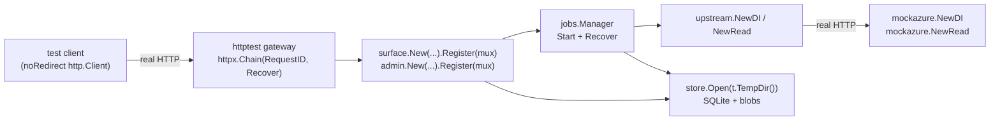
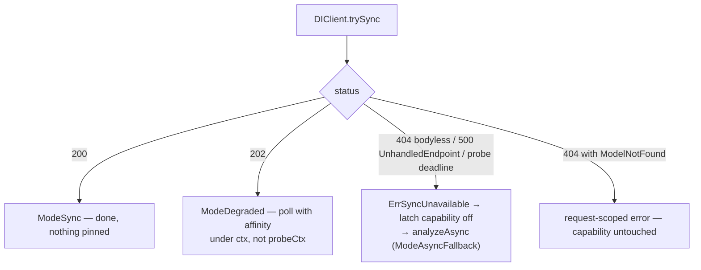

# Testing

This document describes how `azure-gateway-api` is tested and how to verify a change before you
commit it. It is written for someone who has not seen the repository before: it explains what each
layer of the test suite exists for, why the fakes in `internal/mockazure` model failure rather than
success, why most conformance tests exist because a named Azure SDK breaks otherwise, and what is
deliberately left untested. Companion documents: [`README.md`](../README.md),
[`docs/ARCHITECTURE.md`](ARCHITECTURE.md), [`docs/OPERATIONS.md`](OPERATIONS.md),
[`docs/CONTAINER-BEHAVIOUR.md`](CONTAINER-BEHAVIOUR.md), [`docs/HANDOFF.md`](HANDOFF.md),
[`docs/api-surface.md`](api-surface.md), and the approved
[design spec](superpowers/specs/2026-09-08-azure-gateway-api-design.md).

---

## 1. The layers

The gateway has to be wire-identical to two Azure containers it cannot reach from a laptop, and it
has to survive those containers misbehaving. Those are different problems, and they are tested at
different layers.

| Layer | Where | What it is for |
|---|---|---|
| Unit tests | `internal/<pkg>/*_test.go` | One package at a time, with no HTTP surface: parsing, validation, storage semantics, error rendering, ID shape, memory behaviour. |
| Fakes | `internal/mockazure` | Not tests. In-process HTTP servers that impersonate both containers *including their failure modes*, so every other layer can drive the real code paths. |
| Conformance suite | `test/conformance` | A fully wired gateway — surfaces, admin, job manager, SQLite store, upstream clients — driven over real HTTP against the fakes. Asserts what unmodified Azure SDK clients depend on. |
| Real-SDK harness | `test/sdk` | The official Python Azure client libraries pointed at a running gateway. Asserts the SDKs *accept* what the gateway emits. Has never been run against a live gateway (§5). |

Counted today: **57 unit test functions** across the nine `internal` packages that have test files
(one of them, `TestLiveMocks`, is gated off by default) and **45 conformance test functions**.

Five packages have no test file of their own: `cmd/gateway`, `internal/surface`, `internal/admin`,
`internal/logging` and `internal/probe`. `internal/surface` — the client-facing handlers, and by far
the largest of the five at 931 lines, covered to 68.2% — is deliberate: the surfaces are almost
entirely about wire shape, and a handler test driven by a synthetic `httptest.ResponseRecorder`
would assert the shape the handler was written to produce rather than the shape a client receives,
so it is exercised end to end through `test/conformance` instead. The other four are discussed in
§6.

### How the conformance harness is wired

`newHarness` in [`test/conformance/harness_test.go`](../test/conformance/harness_test.go) builds
the whole system in-process, once per test, on a `t.TempDir()` volume:



Two details of the harness carry meaning:

- `noRedirect()` builds every test client with
  `CheckRedirect: func(...) error { return http.ErrUseLastResponse }`. That mirrors the .NET
  pipeline, which sets `AllowAutoRedirect = false` and treats any 3xx as terminal. Following
  redirects in tests would hide a gateway that emits one.
- The harness config is a hand-written `config.Config` literal, not `config.Load()`, so it inherits
  no defaults at all. Most of its values are deliberately test-sized: `DIBlindPollBudget` 10
  (shipped default 60), `MaxInflight` 2 (4), the upstream timeouts 30 s (15 m for DI, 10 m for
  Read), `ResultTTL` 1 h (24 h), `GCInterval` 1 h (5 m), `DiskHighWatermark` 0.99 (0.90),
  `MaxRequestBytes` 16 MiB (500 MiB), `ShutdownGrace` 5 s (30 s), `AllowNetworkFS` true (false).
  Only a few fields coincide with what an operator gets — `TrustForwardedHeaders: false`,
  `DISyncMode: config.SyncAuto`, `QueueDepth: 0`, `PollRetryAfter: 1`, `BusyRetryAfter: 5` — and
  `DISyncProbeTimeout` is left at zero, so `NewDI` clamps it to `DI.Timeout`. `harnessOpts.tweak`
  lets an individual test override one field on top of that literal, which keeps every other test
  honest about the *harness* baseline. It is not a check on `internal/config/config.go`'s
  defaults; `TestLoadDefaults` is.

---

## 2. `internal/mockazure` in detail

The package doc states the reason plainly: the failure modes *are* what the gateway exists to
absorb, so "code that is never exercised against those cases is code that has not been tested."
`NewDI(Options)` and `NewRead(Options)` each start an `httptest.Server` with the routes the
corresponding container serves; `Options` selects which reality you get.

Three accessors make assertions about *which route was taken* possible, which is most of what the
upstream state machine needs proved:

| Method | Use |
|---|---|
| `Hits() int64` | How many analyze calls were served. |
| `Requests() []string` | Every path served, in order. |
| `Called(substr string) bool` | Whether any served path contains `substr` — e.g. `h.di.Called(":syncAnalyze")`. |

### `SyncBehavior` — how the synchronous analyze route answers

Applied in `serveSync`, which backs `POST …:syncAnalyze` on the DI and `/formrecognizer` families
and `POST /vision/v3.2/read/syncAnalyze` on Read.

| Value | Fake response | Real-world condition it reproduces |
|---|---|---|
| `Sync200` | `200` with a succeeded operation envelope | The documented Read behaviour, and the best case for DI: fully stateless, load-balances correctly, nothing pinned to a replica. |
| `Sync202` | `202` + `Operation-Location` naming a freshly minted operation that only this fake knows | The DI container degrading to async under memory pressure. Microsoft has described a 202 on this route as "not standard or documented behavior". The operation now lives on one replica only, so affinity matters from here on. |
| `Sync404` | Bare `404`, **no body at all** | An image build that does not serve the route. Kestrel answers an unrouted path with a bodyless 404, not with a Document Intelligence error object — and that absence is exactly what distinguishes "this build lacks the route" from "this build has it and your model does not exist". |
| `Sync500Unhandled` | `500` `{"error":{"code":"InternalServerError","message":"UnhandledEndpointException: no candidates found for the request path."}}` | Older builds that answer a missing endpoint with a 500 rather than a 404. `looksLikeMissingEndpoint` in `internal/upstream/di.go` matches on `unhandledendpointexception`, `no candidates found for the request path` and `request did not match any endpoints`. |
| `SyncModelNotFound` | `404` wrapped, with `innererror.code = "ModelNotFound"` | The route exists; the *model* does not. This is request-scoped and must **not** latch the capability off — `resourceScoped404` returns true for `InnerModelNotFound` / `InnerOperationNotFound` and for a well-formed `NotFound` carrying a message. |
| `SyncHang` | Accepts the request and blocks on `<-r.Context().Done()`; never answers | The worst case a live probe found: a `layout-4.0` build declares `:syncAnalyze` in its own swagger and then holds the connection past five minutes on a blank 200×120 image. This is why `DI_SYNC_PROBE_TIMEOUT` (default `60s`) exists as a bound separate from `DI_UPSTREAM_TIMEOUT` (default `15m`) — without it, every job in `auto` mode would burn the whole upstream timeout here before falling back to the route that works. |

How each maps onto a gateway branch:



### `Options` — every field

| Field | Where it applies | Condition it reproduces |
|---|---|---|
| `Sync SyncBehavior` | `serveSync` | See the table above. |
| `SyncBodyBare bool` | `serveSync`, `Sync200` path | Returns a bare `AnalyzeResult` rather than the `{"status","createdDateTime","lastUpdatedDateTime","analyzeResult"}` envelope. Which shape the real DI synchronous route returns is question **Q-A2** in the design spec and remains unverified, so the adapter must handle both. |
| `PollsBeforeSuccess int` | `servePoll` | How many polls report `running` before the operation completes — i.e. an analysis that takes real time, so the gateway's poll loop, `Retry-After` emission and status vocabulary are exercised rather than short-circuited. |
| `WrongReplicaEvery int` | `servePoll` | Every Nth poll answers as an unknown id. This is the core problem the gateway exists for: the containers' async result store is instance-local by default, so a round-robin route lands a poll on a replica that never saw the operation. Zero disables it. |
| `FailAnalysis bool` | `serveSync` (`Sync200` path) and `servePoll` | The operation terminates `failed` at **HTTP 200**, carrying a wrapped `error` with `innererror.code = "InvalidContent"`. This is the dominant failure mode on both surfaces. |
| `FailSyncBare bool` | `serveSync`, `Sync200` path | `200 {"status":"Failed"}` — capital F, no code, no message. It is the only error form Microsoft documents for CV `syncAnalyze`, it is unactionable as-is, and `"Failed"` is outside the four status strings every SDK accepts. |
| `PadResultBytes int` | `analyzeResult()`, so both sync and poll bodies | Inflates the result with a `padding` string so the streaming and byte-range composition paths run against a body far larger than any buffer. |
| `Latency time.Duration` | `serveSync` only | Delays the synchronous call. Used to hold an admission slot open (the 429 test) and to have work genuinely in flight when a shutdown signal arrives. |
| `StatusUnhealthy bool` | `GET /status` | Makes the container report `{"apiStatus":"Invalid","apiStatusMessage":"Subscription validation failed."}` instead of `Valid`, i.e. a container whose subscription key was rejected. **No test currently sets this field.** |
| `RequireAPIKey string` | `authorized`, on the analyze POST routes only (not polls, not `/status`, not `/ready`) | A container that rejects a call without `Ocp-Apim-Subscription-Key`, answering `401 Unauthorized`. Proves the gateway injects its own upstream credential while requiring nothing from the client. |
| `MetadataMissing bool` | `GET /documentintelligence/info` and `GET /documentintelligence/documentModels` | A probed layout-4.0 build declares neither metadata route in its swagger and answers both with a bodyless 404. `TestProxyPreservesUpstreamStatus` is built on it: the metadata proxy must relay that status and must not invent a body. |
| `SyncErrorStatus int` | `serveSync`, checked **before** `Sync` | When non-zero, answers with that status, `Content-Type: text/html`, an HTML body (`<html>…413 Request Entity Too Large…</html>`) *and* `Retry-After: 120`. This is the unschematized error class — HTML from an nginx sidecar — that no client SDK can parse, plus a `Retry-After` that azure-core would replay ten times if it were relayed onto a non-retriable status. |

### The error bodies the fakes emit

`writeUnknownID` reproduces what a probe found the real containers answering for an operation id
they do not know, which is **not** what either published contract says:

```jsonc
// Document Intelligence — flat, its one and only unwrapped error
{"code":"NotFound","message":"Analyze result does not exist."}

// Computer Vision Read — wrapped, and it answers BadArgument because its
// ComputerVisionOcrErrorCodes enum contains no not-found code at all
{"error":{"code":"BadArgument","message":"Operation ID is invalid, expired or the results
 matching this operationId have been deleted."}}
```

`SyncModelNotFound` emits the wrapped DI shape with an `innererror`; `Sync500Unhandled` and the
`401` from `authorized` use `writeDIError`, the plain wrapped shape. A path the fake does not route
at all falls through to `http.ServeMux`'s own `NotFoundHandler`, which — unlike Kestrel — writes a
short `text/plain` body. Kestrel's genuinely bodyless 404 is modelled explicitly, by `Sync404`; the
gateway's own unrouted 404 is bodyless because `azerr.Unrouted` sets `bare`, which makes `WriteTo`
send `Content-Length: 0` and no body.

### Driving the shell probe against the fakes

`internal/mockazure/live_test.go` holds both fakes open so
[`scripts/probe-containers.sh`](../scripts/probe-containers.sh) can be exercised without a cluster.
It is skipped unless `MOCKAZURE_LIVE` is set:

```bash
MOCKAZURE_LIVE=1 go test ./internal/mockazure -run TestLiveMocks &
set -a; . /tmp/mockurls.env; set +a && ./scripts/probe-containers.sh
```

`MOCK_DI_SYNC` selects the DI behaviour by ordinal (`0` available, `1` degrades to 202, `2` absent
404, `3` absent 500, `4` model not found — the `SyncBehavior` iota order) and `MOCK_HOLD_SECONDS`
controls how long the fakes stay up, default 120.

---

## 3. The conformance suite

The package comment states the organising principle: *"Each test names the client that breaks if
the assertion fails, because that is the only reason most of these rules exist."*

Almost nothing in this suite is a matter of taste. The gateway's clients are code-generated Azure
SDKs whose pollers make assumptions no published contract records — a hard-coded regex over
`Operation-Location`, a backwards segment count, a `Retry-After` run through an integer
deserialiser. Break one and the failure is remote, opaque and blamed on the wrong component.

### Examples, and the client each one protects

| Test | File | Client it protects, and how it breaks |
|---|---|---|
| `TestDIOperationLocationShape` | `fidelity_test.go` | Checks every constraint at once. Python `_patch.py`, .NET `OperationWithId.cs`, Java `PollingUtils` and JS `pollingHelper` all hard-code `[^:]+://[^/]+/documentintelligence/.+/([^?/]+)` to derive the operation id, so the literal `/documentintelligence/` segment must be present. `Azure.AI.FormRecognizer` 4.x discards the URL and counts backwards after `Split('/','?')`, so `analyzeResults` must be second-from-last and `documentModels` fourth-from-last. `?api-version=` must be emitted because Python never re-appends it. And the URL must contain none of `{`, `}`, `|`, space or `^` — a literal brace raises inside Python's `str.format`, and any of them makes Java's `new URI(path)` throw and silently demote polling. |
| `TestDISubmitOmitsLocationHeader` | `fidelity_test.go` | Python's `get_final_get_url` and JS's `operation.ts` both issue an extra final `GET` to a `Location` header captured from the 202 and then parse *that* response as the analyze result. A `Location` header does not fail the call; it silently returns the wrong body. |
| `TestRetryAfterIsIntegerSeconds` | `fidelity_test.go` | The Python Document Intelligence client runs `Retry-After` through `_deserialize("int", …)`, so an HTTP-date raises `DeserializationError` and fails the call outright. The same helper also asserts the header is *present*: without it azure-core falls back to a 30-second default polling interval, making a sub-second gateway look thirty times slower. |
| `TestNoRetryAfterOnNonRetriableErrors` | `fidelity_test.go` | azure-core's `RetryPolicy.is_retry` retries *any* response ≥ 400 that carries `Retry-After`, bypassing its own method allowlist, up to ten times. A 404 with the header turns one client call into eleven. Checked on three paths: an unknown DI result id, an unknown Read operation id, and an unrouted path. |
| `TestUnknownIDMatchesTheContainersNotTheSpec` | `fidelity_test.go` | Not an SDK rule — a probe finding. DI answers this one error *flat* (`{"code":"NotFound","message":"Analyze result does not exist."}`) while wrapping everything else; Read wraps this one (`BadArgument`) although its own `Ocr.json` models it flat. The gateway reproduces both, because a client being unable to tell the gateway from the container is the entire product. |
| `TestDocumentedCompatRestoresTheSpecShapes` | `fidelity_test.go` | The opt-out: `ERROR_COMPAT=documented` (`azerr.SetCompat(azerr.CompatDocumented)`) restores the published shapes for a client written against the generated SDK models instead of against these containers. |
| `TestReadOperationLocationIsBare` | `fidelity_test.go` | The Computer Vision Read SDK has no poller, so callers follow Microsoft's canonical samples: `location.split("/")[-1]` in Python and `Substring(len-36)` + `Guid.Parse` in .NET. A query string, a trailing slash or a fragment makes the derived id junk, which the SDK then percent-encodes into the path and 404s on. The test asserts the trailing segment is exactly `ids.Len` characters and passes `ids.Valid`. |
| `TestSucceededEnvelopeNestsAnalyzeResult` | `fidelity_test.go` | .NET's `AnalyzeResult.FromLroResponse` calls `GetProperty("analyzeResult")` on the terminal body and throws if it is absent. The same test asserts `resourceLocation` is *not* present, because Python, Java and JS would issue a bogus extra GET to it and parse that as the result. |
| `TestStatusStringsAreExact` | `fidelity_test.go` | Only `notStarted`, `running`, `succeeded`, `failed` are terminal-safe across all four SDK families. `cancelled` is terminal in JS alone; `skipped` in none. |
| `TestPollBodyIsAlwaysJSONWithStatus` | `fidelity_test.go` | Python raises `BadResponse` on an empty body, .NET treats a zero-length stream as failure, Java NPEs. Also asserts `Content-Type: application/json` and a present `Content-Length`. |
| `TestNeverRedirects` / `TestNeverCompressesUnlessAsked` | `fidelity_test.go` | .NET builds its handler with `AllowAutoRedirect = false` and surfaces any 3xx as terminal; it also sends no `Accept-Encoding` at all and cannot decompress. The compression test sets `Accept-Encoding: identity` explicitly, because Go's transport otherwise adds gzip on its own. |
| `TestPollSurvivesWrongReplica404` | `behaviour_test.go` | The core resilience case, driven by `WrongReplicaEvery: 2` — every other poll lands on a replica with no record. The gateway must absorb that and keep trying, because a 404 on a live operation kills Java clients with an opaque `NullPointerException` and marks the operation terminally failed in .NET and JS. |
| `TestBlindPollBudgetIsBounded` | `behaviour_test.go` | The other side of the same tolerance: with `WrongReplicaEvery: 1` the owning replica is genuinely gone, and the operation must fail once `DI_BLIND_POLL_BUDGET` is spent rather than poll forever. |
| `TestReadBareFailedStatusIsTranslated` | `behaviour_test.go` | The bare `{"status":"Failed"}` from CV `syncAnalyze` must be translated to lowercase `failed` with a real error object; capital-F `Failed` is outside every SDK's closed status enum. |
| `TestArtifactsAreCapturedEagerly` | `behaviour_test.go` | `output=pdf` must force the asynchronous upstream path, because result files are addressed by the *container's* operation id and a synchronous call never mints one. Asserts the container's `/pdf` route was called and the stored artifact is then servable from the gateway. |
| `TestLegacyFormRecognizerPrefixIsServed` | `sync_test.go` | A probe found the layout-4.0 build declaring the `/formrecognizer` family alongside `/documentintelligence`, so clients on `azure-ai-formrecognizer` reach the container today. The `Operation-Location` must echo the family the caller arrived on, because every SDK's id-deriving regex hard-codes its own. |
| `TestHungSyncRouteFallsBackQuickly` | `sync_test.go` | Drives `SyncHang` with `DISyncProbeTimeout: 2s` against `DI.Timeout: 60s` and asserts the job still completes promptly, falls back to `:analyze` (`assertJobMode(…, "async-fallback")`), and that a second job does not pay the probe again. |
| `TestSyncPassthroughResolvesADegraded202` | `sync_test.go` | Regression test for the worst client-visible defect the review found: the passthrough relayed the container's 202, handing the caller an empty body and no operation id for an analysis already paid for. The gateway now polls it out and answers 200. |
| `TestPollNeverReturnsABodyWithoutStatus` | `sync_test.go` | Regression test: a succeeded row whose result blob has gone used to answer a bare 500. Java's poller never checks the poll status code — it deserialises, finds no `status`, and throws an opaque `NullPointerException`. The test deletes the blob out from under a completed job and asserts a `200` with `status: "failed"`. |
| `TestResourceScoped404DoesNotDisableTheSyncRoute` | `sync_test.go` | Regression test: latching `:syncAnalyze` off is process-wide and permanent, so treating every 404 as "route absent" meant one request naming a missing model disabled the fast path for every later job until the pod restarted. |
| `TestSignalDoesNotAbortInFlightRequests` | `shutdown_test.go` | Regression test for a graceful shutdown that was not graceful. Request contexts were derived from the signal context, so SIGTERM cancelled every in-flight handler instantly and `Shutdown` returned in about a millisecond. The test builds an `http.Server` with a `BaseContext` distinct from the signal context, fires the signal mid-request, and asserts both that the request completes with 200 *and* that `Shutdown` took longer than 500 ms. |
| `TestBootRecoveryReclaimsJobsWithUnexpiredLeases` | `shutdown_test.go` | Regression test: the boot pass filtered `running` jobs on lease expiry, which is exactly backwards for a crash — the process dies holding a lease minutes in the *future*, so the scan skipped precisely the jobs it existed to rescue. Two `store.Open` calls over one `t.TempDir()` simulate the process boundary. |

Several tests assert the recorded `upstream_mode` rather than only the client-visible result, via
`assertJobMode(t, h, want)` reading `store.Recent`. The three values come from
`internal/store/db.go`: `sync`, `degraded-202`, `async-fallback`. Asserting the mode is what stops
a test from passing for the wrong reason — a correct answer reached down the slow path is a
regression, not a success.

### Adding a new fidelity test

1. **Find or write down the reason.** A fidelity rule is only worth a test if you can name what
   breaks: a specific SDK file and expression, or a specific probe observation. If you cannot,
   you are testing a preference, and it belongs somewhere else.
   [`docs/api-surface.md`](api-surface.md) §4, §5, §6 and §10 carry the derivations with citations;
   [`docs/CONTAINER-BEHAVIOUR.md`](CONTAINER-BEHAVIOUR.md) carries the probe observations.

2. **Teach the fake the behaviour, if it does not know it yet.** New container behaviour goes in
   `internal/mockazure` as either a new `SyncBehavior` value or a new `Options` field, with a doc
   comment naming the real-world condition it reproduces. Keep the default zero value equal to the
   healthy case, so existing tests are unaffected.

3. **Add the test to the file that matches its kind.**

   | File | Kind |
   |---|---|
   | `fidelity_test.go` | A wire-shape rule an SDK depends on: headers, status codes, body shape, status vocabulary. |
   | `behaviour_test.go` | Upstream strategy and lifecycle: which route was used, TTL, artifacts, recovery, admission. |
   | `sync_test.go` | Regressions in the synchronous path and the upstream state machine. |
   | `shutdown_test.go` | Durability across a process boundary or a signal. |
   | `legacy_family_test.go` | The `/formrecognizer` family: that it is served, and served identically. |

4. **Drive it through the harness, not through a handler.**
   `h := newHarness(t, harnessOpts{di: mockazure.Options{…}, tweak: func(c *config.Config){…}})`,
   then `h.post(...)` / `h.get(...)` / `h.pollUntil(loc, "succeeded")`. Use `harnessOpts.tweak`
   only for the one field the test is about; everything else should stay at the harness baseline
   (§1), so a failure points at your field and not at a second thing you moved.

5. **Write the failure message for the person who did not write the test.** Every assertion in
   this suite says what breaks, not just what mismatched — for example, *"Operation-Location %q has
   a query string; the Python sample's split(\"/\")[-1] then percent-encodes it into the path and
   404s"*. Follow that. Six months from now the message is the only documentation anyone reads.

6. **Prove it fails first.** Every regression test in this suite was written against the defect it
   describes and watched to fail before the fix landed. A green new test is not evidence of
   anything until you have seen it red.

---

## 4. Running things

### Commands

| Command | What it does |
|---|---|
| `go test ./...` | The whole suite, no race detector. ~35 s on an M-series laptop, of which `test/conformance` is ~35 s — the rest run in parallel behind it. |
| `go test -race ./...` (= `make test`) | The same suite with the race detector. ~41 s. This is the gate. |
| `make test-short` | `go test ./...`. Note the name: it drops the race detector, it does not pass Go's `-short` flag. |
| `make lint` | `gofmt -l .` (fails on any output), `go vet ./...`, then `staticcheck ./...` **if it is on `PATH`** — otherwise it prints `staticcheck not installed, skipped` and `make check` still passes. Install it if you want that gate to mean anything. |
| `make check` | `lint` then `test`. Everything CI would run. |
| `make cover` | Coverage, see below. |
| `go test -run TestName ./test/conformance` | One test. Add `-v` for the harness's log lines and `-count=1` to defeat the test cache. |

The conformance suite dominates the wall time because several tests are about real elapsed time:
`TestExpiredOperationReturns404` sleeps past a 2 s TTL, `TestAdmissionReturns429WithRetryAfter`
holds a slot with a 2 s upstream latency, `TestHungSyncRouteFallsBackQuickly` waits out a 2 s probe
timeout, and `TestSignalDoesNotAbortInFlightRequests` needs a 1.5 s request genuinely in flight
when the signal fires. Those numbers are the point of the tests and should not be tuned down.

### Coverage

```bash
make cover
# go test -coverprofile=coverage.out -coverpkg=./internal/... ./...
# go tool cover -func=coverage.out | tail -1
```

`-coverpkg=./internal/...` is what makes the number meaningful: without it, `test/conformance`
would report its own (empty) coverage and the packages it actually exercises would report nothing.
`cmd/gateway` is outside `-coverpkg` and so is excluded from the total entirely.

Measured on the current tree, `total: (statements) 65.4%`. Per package, from the same profile:

| Package | Statement coverage | Note |
|---|---|---|
| `internal/ids` | 97.4% | |
| `internal/mockazure` | 83.0% | The fakes are themselves covered by the suite that uses them. |
| `internal/azerr` | 79.7% | |
| `internal/jsonx` | 76.6% | |
| `internal/config` | 76.5% | |
| `internal/store` | ~74.8% | |
| `internal/jobs` | ~70% | |
| `internal/surface` | 68.2% | No unit tests; entirely via `test/conformance`. |
| `internal/httpx` | 67.6% | |
| `internal/upstream` | ~64% | |
| `internal/logging` | 20.0% | Only the context pair every request touches; see §6. |
| `internal/admin` | 10.0% | Registered by the conformance harness, almost never called by it. |
| `internal/probe` | 0.0% | See §6. |
| **total** | **~65%** | Below the 80% bar the README's *Status* section names. |

Expect the total and the three approximate rows to move a fraction of a point between runs. The
blocks that come and go are all teardown races: `base.unreachable`'s "the context was cancelled,
not the container" branch, the `<-ctx.Done()` arms of the recovery pass's admission and queue
selects, `run`'s *job vanished before it ran*, and `store.Get`'s `ErrNoJob`. Whether a test's
cleanup cancels its context while something is still in flight is a matter of scheduling, so a
number that moves by half a point is variance rather than a regression. The other rows reproduce
exactly.

The design spec's *Coverage* section quotes slightly different figures (`ids` 98%, `jsonx` 86%,
`azerr` 80%, `store` 75%, `surface` 70%, `jobs` 70%, ~60% overall). The table above is what the
current tree measures; the spec's numbers predate later commits and should be treated as stale.

To reproduce the per-package breakdown, which `go tool cover -func` does not print:

```bash
go test -coverprofile=coverage.out -coverpkg=./internal/... ./...
awk 'NR>1{s[$1]=$2; if($3>0) h[$1]=1}
     END{for(k in s){split(k,a,":"); n=split(a[1],p,"/"); d="";
       for(i=1;i<n;i++) d=d p[i] "/"; t[d]+=s[k]; if(k in h) c[d]+=s[k]}
       for(d in t) printf "%6.1f%%  %s\n", 100*c[d]/t[d], d}' coverage.out | sort -k2
```

(The profile contains one block set per test binary, so the counts must be merged by block key
before they are summed — that is what the `s[$1]` / `h[$1]` maps do.)

### The Dockerfile's in-image test stage

[`Dockerfile`](../Dockerfile) runs the suite inside the build stage, after the binary is linked:

```dockerfile
RUN CGO_ENABLED=0 GOOS=linux GOARCH=${TARGETARCH} \
    go build -trimpath -ldflags="…" -o /out/gateway ./cmd/gateway
RUN CGO_ENABLED=0 go test ./...
```

That looks redundant next to a local `go test`, and it is not. **It has caught bugs the local run
missed**, twice, and the repository records both:

- `TestSweepAndBootRecoveryCannotBothEnqueue` in `internal/jobs/recovery_test.go` opens with:
  *"reproduces the ordering that failed inside the image build but not on the developer's
  machine: the sweeper's startup pass reached an abandoned row before the explicit boot recovery
  did, and the container ran the analysis twice."*
- Commit `8c926ef` records the same thing about its own predecessor's fix — *"one defect in the
  previous commit's own recovery fix, which only the in-image test run caught"* — and closes with
  *"docker build linux/amd64, whose test stage is what surfaced the last two bugs."*

The reason is scheduling, not the container. Three things differ from a laptop run:

1. **Architecture and emulation.** `make image` passes `--platform linux/amd64`, so on an Apple
   Silicon host the entire build stage — including `go test` — runs `linux/amd64` under emulation.
   Everything is slower and slowed unevenly, which widens windows a native run closes in
   nanoseconds. The recovery bug was exactly that: two independent paths reaching the same
   `notStarted` row, a race whose losing interleaving is rare at native speed.
2. **CPU allocation.** `GOMAXPROCS` follows what the container runtime grants the build, which is
   usually well below the host's core count. Fewer runnable Ps changes which goroutine wins.
3. **A cold cache.** The `RUN` layer has no Go test cache, so every package genuinely re-runs
   rather than replaying `(cached)`.

Two limits worth knowing: the in-image run is **not** a race-detector run — `CGO_ENABLED=0` and no
`-race` — so it adds scheduling diversity, not race detection; and its `go test` line inherits the
build container's own `GOOS`/`GOARCH` rather than the `TARGETARCH` build arg, so it tests whatever
platform the builder image is, which `--platform linux/amd64` pins.

Run it with `make image`. Treat a failure there as real even when the local suite is green — that
is the whole reason the stage exists.

---

## 5. `test/sdk` — the real Azure SDK harness

### What it proves that nothing else does

`test/conformance` asserts what the gateway **emits**. `test/sdk` asserts that the official client
libraries **accept** it. Those are different questions, because the parts that break a proxy live
inside SDK poller internals rather than in any published contract — a regex in `_patch.py`, a
backwards segment count in `OperationWithId.cs`, an integer deserialiser applied to `Retry-After`.
Every rule in the conformance suite is a reading of those internals. This harness is the only place
the reading itself is checked.

### How to run it

```bash
# terminal 1 — a gateway pointed at real containers (or at the fakes)
DI_UPSTREAM_URL=http://layout:5000 READ_UPSTREAM_URL=http://read:5000 DATA_DIR=./data make run

# terminal 2
make sdk-test           # == cd test/sdk && ./run.sh
```

`run.sh` refuses to start unless `GET ${GATEWAY_URL}/_gw/live` succeeds; `GATEWAY_URL` defaults to
`http://localhost:8080`. It creates `test/sdk/.venv` on first use and installs
`azure-ai-documentintelligence>=1.0.0`, `azure-cognitiveservices-vision-computervision>=0.9.0` and
`pillow>=10.0.0` from `requirements.txt`. The gateway requires no client credential, so
`sdk_test.py` passes the placeholder key `"not-required-by-this-gateway"` that the SDK constructors
insist on. The sample document is a white 200×120 PNG — above Azure's 50×50 minimum — built with
Pillow, falling back to a base64-embedded 100×100 PNG so Pillow stays optional.

### What each check maps to

| Check in `sdk_test.py` | Gateway property it exercises |
|---|---|
| `begin_analyze_document` returns without raising | The submit answered **exactly** 202. Python's `_analyze_document_initial`, .NET's `StatusCodeClassifier{202}`, Java's `@ExpectedResponses({202})` and JS's `isUnexpected` all reject 200 and 201. |
| `poller.details["operation_id"]` parses as a UUID | `Operation-Location` matches `[^:]+://[^/]+/documentintelligence/.+/([^?/]+)`. A wrong shape raises `AttributeError` rather than returning anything. |
| `poller.result()` completes | The terminal body nests `analyzeResult`, and no `Location` header or `resourceLocation` member triggered a bogus final GET. |
| `result.model_id` is set | The stored envelope deserialises into the SDK's own model. |
| The operation finished in under 25 s | `Retry-After` was present and parseable; otherwise azure-core falls back to a 30 s default polling interval and the elapsed time gives it away. |
| `Operation-Location.split("/")[-1]` parses as a UUID | The Read header is bare — no query string, no trailing slash, no fragment. This is literally the line Microsoft's canonical sample runs. |
| `get_read_result` reaches `succeeded`, and the status is inside `{notStarted, running, failed, succeeded}` | The Read status enum is `modelAsString: false`, so an unrecognised value degrades to a raw string and the canonical sample's `while` loop never terminates. |
| Unknown ids 404 with a parseable body and no `Retry-After` | The 404 policy and the per-surface error shapes. |

### It has not been run

**`make sdk-test` has never been executed against a live gateway.** The README says so under
*Status*, and it is the acceptance test that matters: everything else in this repository is the
gateway being marked by its own homework. Until it runs, treat "wire-identical" as designed and
argued rather than demonstrated.

One thing to fix before or while running it, found by reading the harness against the current
code: `test_unknown_operation_is_a_clean_404` in `sdk_test.py` encodes the **documented** error
shapes — wrapped for Document Intelligence, flat for Read — while the gateway's default
`ERROR_COMPAT=observed` emits the **observed** ones, which are the other way round (see §2 and
`internal/azerr/azerr.go`). Its predicates match `internal/azerr`'s `CompatDocumented` branch
exactly. So against a default gateway those two checks will report FAIL for a gateway that is
behaving correctly. Either run that harness against a gateway started with `ERROR_COMPAT=documented`,
or update the two predicates to match `TestUnknownIDMatchesTheContainersNotTheSpec` in
`test/conformance/fidelity_test.go`. The other checks are unaffected.

---

## 6. What is deliberately not tested

Two packages are deliberately untested, for the same reason: everything they do is real I/O against
things that do not exist on a laptop, and a test with those dependencies faked would assert only
that the fake was called.

**`cmd/gateway`** (250 lines) is wiring and process lifecycle: parse the subcommand, load config,
build the logger, open the store, construct the manager and surfaces, install signal handling, run
`http.Server`, drain on SIGTERM. It is excluded from the coverage profile by `-coverpkg=./internal/...`.
What it wires is covered elsewhere — `config.Load` in `internal/config/config_test.go`, the
handler chain and the whole request path in `test/conformance`, and its most load-bearing decision,
the separation of the signal context from the request `BaseContext`, is reproduced deliberately in
`TestSignalDoesNotAbortInFlightRequests`. The residue that is genuinely untested is argument
parsing and exit codes, verified by hand.

**`internal/probe`** (273 lines, 0.0% covered) exists to interrogate live containers: it GETs each
container's `/status`, `/ready` and whichever of its candidate `/swagger` paths answers — four for
Document Intelligence, two for Read — POSTs a generated blank PNG to `:syncAnalyze` and `:analyze`
on both surfaces, GETs `analyzeResults/` with a zero GUID to capture the unknown-id error shape,
and reports what came back. Its entire value is that it talks to something the repository cannot
simulate — a test against `mockazure` would prove only that the probe agrees with a fake written
from the same assumptions the probe exists to check. It is exercised by running it: `make probe`
(the shell script) or `make probe-go` (`./bin/gateway probe`), and against the fakes via the
`MOCKAZURE_LIVE` recipe in §2, which is how both were debugged.

Three smaller gaps, stated rather than hidden:

- `internal/logging` (20.0%) — the constructor is the part that never runs. `logging.New` and its
  helper `parseLevel` measure 0%: they are reached only from `cmd/gateway/main.go`, and every test
  builds its own logger with `slog.New(slog.NewTextHandler(io.Discard, nil))`. The covered fifth is
  the context pair `WithLogger`/`From`, which `internal/httpx` and `internal/surface` call on every
  request and the conformance suite therefore exercises throughout.
- `internal/admin` (10.0%) has no tests of its own. `/_gw/live`, `/_gw/ready`, `/_gw/health`,
  `/_gw/version`, `/_gw/config`, `/_gw/jobs`, `/_gw/jobs/{id}` and `/_gw/metrics` — plus the
  gateway's own root `/ready` and `/status`, which it serves rather than proxying because both
  containers claim those paths (design decision D8) — are all registered by the conformance harness
  but almost never called by it. `/_gw/config` is the exception, because what it renders is
  `Config.Redacted()` and both halves of that are covered in `internal/config/config_test.go`,
  which is where the handling actually lives: `TestRedactedHidesEverySecret` checks that neither an
  API key nor userinfo embedded in an upstream URL survives, while the host stays legible, and
  `TestRedactedCoversEveryField` walks the `Config` struct by reflection so a field added and not
  surfaced fails the suite rather than quietly disappearing from the operator's only view of
  effective configuration.
- `mockazure.Options.StatusUnhealthy` — a container reporting an invalid subscription key — is
  implemented in the fake and used by no test.

---

## 7. Verifying a change before you commit

In order. Each step is cheap relative to the one after it, so stopping early costs nothing.

1. **`gofmt -l .`** — must print nothing.

2. **`go vet ./...`** — must be silent.

3. **`go test ./...`** — fast feedback, ~35 s. Fix anything red here before going further.

4. **`go test -race ./...`** (`make test`) — the actual gate, ~41 s. This suite has real
   concurrency in it: a worker pool, a lease/heartbeat, a TTL sweeper, a recovery pass and a
   graceful drain, all touching one SQLite store. Never commit on the strength of the non-race run.

5. **`make cover`, and read the number.** It should not go down. If you added a branch in
   `internal/upstream`, `internal/jobs` or `internal/store`, it should go up.

6. **Did you change wire-visible behaviour?** Headers, status codes, body shape, status strings,
   `Operation-Location`, `Retry-After`, error shapes, the 404 policy. If so there must be a
   conformance test naming the client or the probe observation that motivates it — see §3, *Adding
   a new fidelity test* — and you must have watched it fail before your change.

7. **Did you change container-facing behaviour?** The upstream state machine, the sync capability
   latch, the poll loop, artifact fetching. If so, `internal/mockazure` must model the case, and the
   test should assert the recorded mode with `assertJobMode` — `sync`, `degraded-202` or
   `async-fallback` — not only the client-visible result. A correct answer reached down the wrong
   path is a regression.

8. **Did you change a default?** Env var defaults live in `internal/config/config.go`, not in the
   README. Update `TestLoadDefaults` in `internal/config/config_test.go`, then the README and
   [`docs/OPERATIONS.md`](OPERATIONS.md). If you added a *field* rather than changed a value,
   `TestRedactedCoversEveryField` will fail until you also surface it in `Config.Redacted()`, which
   is what `/_gw/config` renders.

9. **`make image`** — builds `linux/amd64` and runs the whole suite inside the image. Slower, and
   worth it: this stage has caught two ordering bugs a green local run missed (§4). Do not skip it
   for a change that touches `internal/jobs`, `internal/store` or anything else with concurrent
   access to the store.

10. **`make check`** as the final sweep — lint plus the race suite in one command. If
    `staticcheck` is not installed it is silently skipped, so install it if you want that gate.

11. **If a gateway or a container is reachable to you, run `make sdk-test`.** It is the only check
    that proves a real Azure SDK accepts what the gateway emits, and it has never been run (§5).
    Note the `ERROR_COMPAT` caveat in §5 before reading its 404 results.

Finally, the repository's own convention, visible in every commit body: state what you verified,
by name. `gofmt`, `go vet`, `go test -race`, `docker build linux/amd64` — and say which of them
actually surfaced the defect you fixed.
